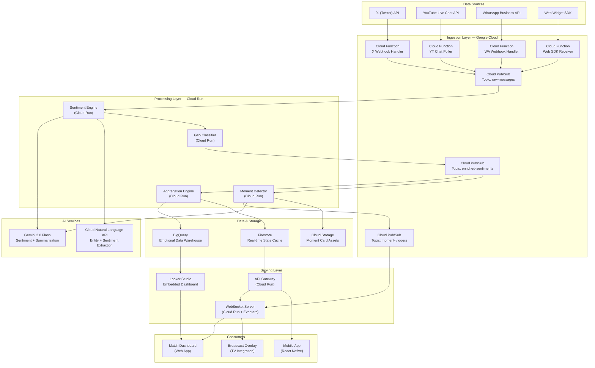
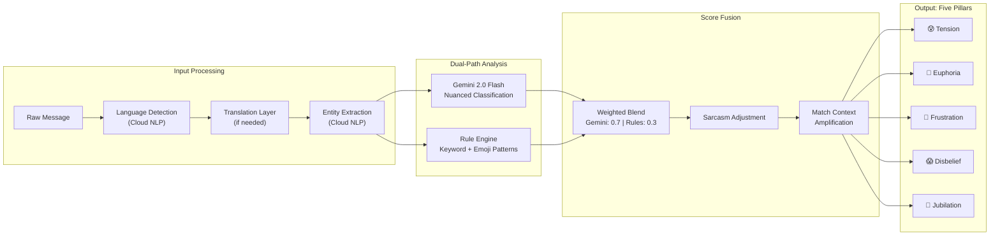
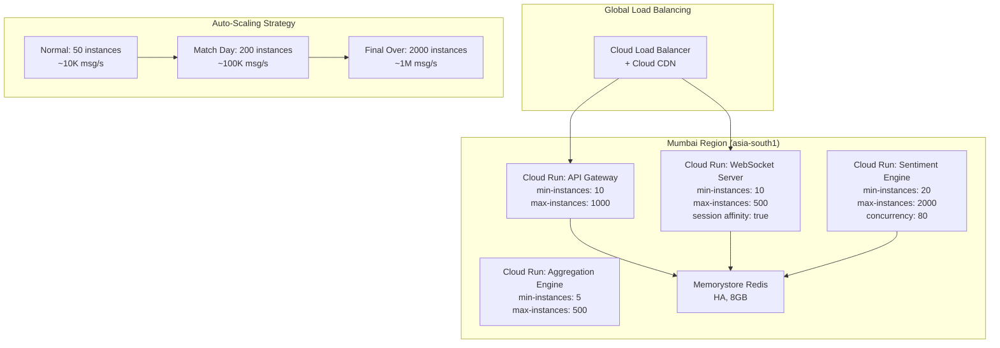

# Crowd Pulse — System Architecture

## 1. High-Level System Architecture



---

## 2. Data Pipeline — Latency Budget

The end-to-end pipeline must achieve **<3 seconds** from event occurrence to UI update.

```mermaid
gantt
    title Latency Budget: Event → UI Update (Target <3000ms)
    dateFormat X
    axisFormat %Lms

    section Ingestion
    Webhook/API Receipt       :a1, 0, 100
    Pub/Sub Publish           :a2, 100, 150

    section Processing
    Sentiment Analysis (Gemini Flash) :b1, 150, 800
    Geo Classification        :b2, 800, 950
    Aggregation + Outlier Detection :b3, 950, 1200

    section Storage
    Firestore Write           :c1, 1200, 1400
    BigQuery Streaming Insert :c2, 1200, 1600

    section Delivery
    WebSocket Push            :d1, 1400, 1600
    Client Render             :d2, 1600, 1800
```



### Latency Breakdown

| Stage | Target | Strategy |
|-------|--------|----------|
| Ingestion | <150ms | Cloud Functions with min-instances=5 for zero cold-start |
| Sentiment Analysis | <650ms | Gemini 2.0 Flash with batch-of-10 micro-batching |
| Geo Classification | <150ms | In-memory city lookup + linguistic markers cache |
| Aggregation | <250ms | Sliding window aggregation in Cloud Run with local state |
| Storage Write | <200ms | Firestore for real-time, BigQuery streaming insert async |
| WebSocket Delivery | <200ms | Cloud Run WebSocket with Redis Pub/Sub fan-out |
| Client Render | <200ms | Incremental DOM updates, requestAnimationFrame |
| **Total** | **<1800ms** | **800ms buffer for spikes** |

---

## 3. BigQuery Schemas

### 3.1 Raw Messages Table

```sql
CREATE TABLE crowd_pulse.raw_messages (
    message_id          STRING        NOT NULL,   -- UUID v7 (time-sortable)
    match_id            STRING        NOT NULL,   -- e.g., "IPL2026_MI_CSK_052"
    source_platform     STRING        NOT NULL,   -- ENUM: 'twitter', 'youtube', 'whatsapp', 'web'
    source_user_id      STRING,                    -- Hashed user identifier
    raw_text            STRING        NOT NULL,   -- Original message text
    detected_language   STRING,                    -- ISO 639-1 code
    timestamp_ingested  TIMESTAMP     NOT NULL,   -- When message hit our pipeline
    timestamp_source    TIMESTAMP,                 -- Original post timestamp
    geo_country         STRING,                    -- Country code (ISO 3166-1)
    geo_city            STRING,                    -- Detected city
    geo_latitude        FLOAT64,                   -- If available
    geo_longitude       FLOAT64,                   -- If available
    geo_source          STRING,                    -- 'gps', 'profile', 'linguistic', 'ip'
    metadata            JSON                       -- Platform-specific metadata
)
PARTITION BY DATE(timestamp_ingested)
CLUSTER BY match_id, source_platform;
```

### 3.2 Aggregated Emotions Table (Primary Analytics Table)

```sql
CREATE TABLE crowd_pulse.aggregated_emotions (
    agg_id              STRING        NOT NULL,   -- Composite key
    match_id            STRING        NOT NULL,
    over_number         INT64         NOT NULL,   -- 1-20 (or 1-5 for super over)
    ball_number         INT64,                     -- 1-6, NULL for over-level agg
    interval_start      TIMESTAMP     NOT NULL,
    interval_end        TIMESTAMP     NOT NULL,
    interval_duration_s INT64         NOT NULL,   -- Aggregation window (default: 30s)
    
    -- Five Emotional Pillars (0.0 to 1.0 normalized scores)
    tension_score       FLOAT64       NOT NULL,
    euphoria_score      FLOAT64       NOT NULL,
    frustration_score   FLOAT64       NOT NULL,
    disbelief_score     FLOAT64       NOT NULL,
    jubilation_score    FLOAT64       NOT NULL,
    
    -- Dominant emotion for quick queries
    dominant_emotion    STRING        NOT NULL,   -- Highest scoring pillar
    dominant_score      FLOAT64       NOT NULL,
    
    -- Volume metrics
    message_count       INT64         NOT NULL,   -- Total messages in window
    unique_users        INT64         NOT NULL,
    messages_per_second FLOAT64       NOT NULL,
    
    -- Platform breakdown (STRUCT for efficiency)
    platform_breakdown  ARRAY<STRUCT<
        platform        STRING,
        count           INT64,
        avg_tension     FLOAT64,
        avg_euphoria    FLOAT64,
        avg_frustration FLOAT64,
        avg_disbelief   FLOAT64,
        avg_jubilation  FLOAT64
    >>,
    
    -- Geographic breakdown
    city_breakdown      ARRAY<STRUCT<
        city            STRING,
        country         STRING,
        count           INT64,
        dominant_emotion STRING,
        dominant_score  FLOAT64
    >>,
    
    -- Match context (from cricket API)
    match_event         STRING,         -- 'wicket', 'six', 'four', 'dot', 'wide', 'no_ball', 'over_end'
    batting_team        STRING,
    bowling_team        STRING,
    current_score       STRING,         -- e.g., "156/4"
    run_rate            FLOAT64,
    required_run_rate   FLOAT64,        -- In chase scenarios
    
    -- Processing metadata
    processing_latency_ms INT64,
    gemini_model_version  STRING,
    
    timestamp_created   TIMESTAMP     NOT NULL DEFAULT CURRENT_TIMESTAMP()
)
PARTITION BY DATE(interval_start)
CLUSTER BY match_id, over_number;
```

### 3.3 Moment Cards Table

```sql
CREATE TABLE crowd_pulse.moment_cards (
    moment_id           STRING        NOT NULL,
    match_id            STRING        NOT NULL,
    trigger_timestamp   TIMESTAMP     NOT NULL,
    
    -- Moment metadata
    title               STRING        NOT NULL,   -- e.g., "THE COLLAPSE! 4 Wickets in 8 balls"
    key_emotion         STRING        NOT NULL,   -- Primary emotion
    emotion_intensity   FLOAT64       NOT NULL,   -- 0.0-1.0, must be >0.85 to trigger
    context_summary     STRING        NOT NULL,   -- Gemini-generated 2-sentence context
    
    -- Trigger conditions
    trigger_type        STRING        NOT NULL,   -- 'spike', 'reversal', 'sustained', 'divergence'
    spike_magnitude     FLOAT64,                   -- How many std devs above mean
    affected_pillars    ARRAY<STRING>,             -- Which emotions spiked
    
    -- Statistical context
    baseline_score      FLOAT64       NOT NULL,   -- Rolling 5-over average
    peak_score          FLOAT64       NOT NULL,   -- Peak during moment
    message_velocity    FLOAT64       NOT NULL,   -- Messages/sec during moment
    
    -- Content
    top_messages        ARRAY<STRUCT<
        text            STRING,
        platform        STRING,
        sentiment_score FLOAT64
    >>,                                            -- Top 5 representative messages
    
    -- Generated assets
    card_image_url      STRING,                    -- GCS URL for rendered card
    card_video_url      STRING,                    -- GCS URL for animated version
    
    -- Broadcast flags
    is_broadcast_ready  BOOL          DEFAULT FALSE,
    broadcast_priority  INT64,                     -- 1=highest priority
    
    timestamp_created   TIMESTAMP     NOT NULL DEFAULT CURRENT_TIMESTAMP()
)
PARTITION BY DATE(trigger_timestamp)
CLUSTER BY match_id, key_emotion;
```

---

## 4. Gemini API Prompt Template

### 4.1 Sentiment Classification Prompt

```
SYSTEM PROMPT:
You are CrowdPulse Sentiment Engine, an expert in analyzing cricket fan emotions during live IPL matches. You understand:
- Multi-lingual cricket vernacular (Hindi, Tamil, Telugu, Kannada, Bengali, Marathi, English, Hinglish)
- Cricket slang, abbreviations, and memes (e.g., "thala for a reason", "RCB 49 PTSD", "intent™")
- Sarcasm and irony common in cricket Twitter (e.g., "Great captaincy 🤡" = frustration, not euphoria)
- Team-specific fan cultures and rivalries
- Emoji-heavy communication patterns

CLASSIFICATION FRAMEWORK:
Score each message on these 5 emotional pillars (0.0 to 1.0):

1. TENSION: Anticipation, nervousness, nail-biting moments
   - Indicators: "can't watch", "heart rate 📈", "need 12 off 6", "kya hoga ab"
   
2. EUPHORIA: Pure joy, celebration, ecstasy
   - Indicators: "YESSSSS", "WHAT A SHOT", "kya maaraaaa", "🔥🔥🔥", "take a bow"
   
3. FRUSTRATION: Anger, disappointment, criticism
   - Indicators: "why would you play that", "dropped again 🤦", "bekaar bowling", "sack the coach"
   
4. DISBELIEF: Shock, amazement, unexpected events
   - Indicators: "NO WAY", "how is that possible", "are you kidding me", "script writers 📝"
   
5. JUBILATION: Triumphant celebration, vindication, team pride
   - Indicators: "WE WON", "champions!", "legacy cemented", "apni team 💪", "whistlepodu"

RULES:
- Multiple pillars CAN score high simultaneously (e.g., a last-ball six = high euphoria + high disbelief + high jubilation)
- Account for team affiliation context when provided
- Neutral/irrelevant messages should score <0.1 on all pillars
- Sarcasm detection is CRITICAL — "nice bowling 😂" during a six = frustration, not euphoria
- Emoji clusters amplify the dominant emotion
- ALL CAPS indicates heightened intensity (+0.1-0.2 to dominant pillar)

INPUT FORMAT:
{
  "messages": [
    {
      "id": "<message_id>",
      "text": "<raw_message_text>",
      "platform": "<twitter|youtube|whatsapp|web>",
      "language": "<detected_language>",
      "team_context": "<batting_team> vs <bowling_team>",
      "match_situation": "<current_score>, <overs>, <required_rr>"
    }
  ]
}

OUTPUT FORMAT (strict JSON):
{
  "results": [
    {
      "id": "<message_id>",
      "tension": 0.0-1.0,
      "euphoria": 0.0-1.0,
      "frustration": 0.0-1.0,
      "disbelief": 0.0-1.0,
      "jubilation": 0.0-1.0,
      "dominant_emotion": "<pillar_name>",
      "confidence": 0.0-1.0,
      "is_sarcastic": true/false,
      "detected_team_affiliation": "<team_code|null>"
    }
  ]
}
```

### 4.2 Moment Card Generation Prompt

```
SYSTEM PROMPT:
You are the CrowdPulse Moment Writer. When an emotional outlier is detected in a live IPL match, you generate a concise, viral-quality "Moment Card" that captures the collective emotion of millions of fans.

INPUT:
{
  "match": "<Team A> vs <Team B>",
  "event": "<what_happened>",
  "over": <over_number>,
  "ball": <ball_number>,
  "emotion_data": {
    "dominant_emotion": "<pillar>",
    "intensity": <0.0-1.0>,
    "spike_type": "<spike|reversal|sustained>",
    "messages_per_second": <number>,
    "top_fan_messages": ["<msg1>", "<msg2>", "<msg3>"]
  }
}

OUTPUT FORMAT (strict JSON):
{
  "title": "<MAX 8 WORDS, punchy, uses cricket vernacular>",
  "key_emotion": "<emotion_pillar>",  
  "emoji": "<single representative emoji>",
  "context": "<2 sentences: what happened + why fans reacted this way>",
  "fan_quote": "<best fan message, cleaned up>",
  "intensity_label": "<Simmering|Building|Surging|Explosive|NUCLEAR>"
}

STYLE GUIDE:
- Titles should feel like ESPN Cricinfo headlines meets meme culture
- Use dramatic punctuation sparingly but effectively
- Context should be understood by someone NOT watching the match
- Examples: "THE STUMPS ARE FLYING! 4 in 4!", "Silence in Mumbai. 49 All Out Flashbacks."
```

---

## 5. Broadcast Integration API Schema

### 5.1 Emotional Scoreboard Overlay API

```yaml
openapi: 3.0.3
info:
  title: CrowdPulse Broadcast API
  version: 1.0.0
  description: Real-time emotional scoreboard for broadcast overlay integration

servers:
  - url: https://api.crowdpulse.live/v1

paths:
  /matches/{matchId}/scoreboard:
    get:
      summary: Get current emotional scoreboard state
      description: Returns the latest aggregated emotional state for broadcast overlay rendering
      parameters:
        - name: matchId
          in: path
          required: true
          schema:
            type: string
          example: "IPL2026_MI_CSK_052"
      responses:
        '200':
          description: Current emotional state
          content:
            application/json:
              schema:
                $ref: '#/components/schemas/EmotionalScoreboard'

  /matches/{matchId}/scoreboard/stream:
    get:
      summary: WebSocket stream for real-time updates
      description: |
        Upgrades to WebSocket. Pushes EmotionalScoreboard updates
        every 5 seconds or on significant emotional shift (>0.15 change).
      parameters:
        - name: matchId
          in: path
          required: true
          schema:
            type: string

  /matches/{matchId}/moments:
    get:
      summary: Get triggered moment cards
      parameters:
        - name: matchId
          in: path
          required: true
          schema:
            type: string
        - name: since
          in: query
          schema:
            type: string
            format: date-time
          description: Return moments after this timestamp
      responses:
        '200':
          description: List of moment cards
          content:
            application/json:
              schema:
                type: array
                items:
                  $ref: '#/components/schemas/MomentCard'

components:
  schemas:
    EmotionalScoreboard:
      type: object
      properties:
        match_id:
          type: string
        timestamp:
          type: string
          format: date-time
        over:
          type: integer
        ball:
          type: integer
        emotions:
          type: object
          properties:
            tension:
              $ref: '#/components/schemas/EmotionPillar'
            euphoria:
              $ref: '#/components/schemas/EmotionPillar'
            frustration:
              $ref: '#/components/schemas/EmotionPillar'
            disbelief:
              $ref: '#/components/schemas/EmotionPillar'
            jubilation:
              $ref: '#/components/schemas/EmotionPillar'
        dominant:
          type: string
          enum: [tension, euphoria, frustration, disbelief, jubilation]
        message_velocity:
          type: number
          description: Messages per second
        total_messages:
          type: integer
        active_cities:
          type: integer
        trend:
          type: string
          enum: [rising, stable, falling, volatile]

    EmotionPillar:
      type: object
      properties:
        score:
          type: number
          minimum: 0
          maximum: 1
        delta:
          type: number
          description: Change from previous interval
        trend:
          type: string
          enum: [up, down, stable]
        percentile:
          type: integer
          description: Current score percentile vs match history

    MomentCard:
      type: object
      properties:
        moment_id:
          type: string
        title:
          type: string
        key_emotion:
          type: string
        emoji:
          type: string
        context:
          type: string
        intensity_label:
          type: string
          enum: [Simmering, Building, Surging, Explosive, NUCLEAR]
        timestamp:
          type: string
          format: date-time
        card_image_url:
          type: string
          format: uri
```

---

## 6. Sentiment Scoring Model — Five Pillar Architecture



### Outlier Detection for Moment Cards

A Moment Card is triggered when ANY of these conditions are met:

| Trigger Type | Condition | Example |
|---|---|---|
| **Spike** | Any pillar jumps >2.5σ above 5-over rolling mean | Sudden wicket cluster |
| **Reversal** | Dominant emotion switches AND delta >0.4 | Catch dropped → six hit |
| **Sustained** | Any pillar stays >0.8 for >3 consecutive windows | Last over of a close chase |
| **Divergence** | City-level sentiment diverges >0.5 (e.g., Mumbai joy vs Chennai frustration) | Home team winning |

---

## 7. Deployment Architecture



### Cost Optimization
- **Pre-warm** instances 30 min before match start
- **Scale-to-zero** between matches
- **Batch Gemini calls** (10 messages/request) to reduce API calls by 10x
- **BigQuery streaming buffer** with 5-second flush intervals
- **Cloud CDN** for static dashboard assets
