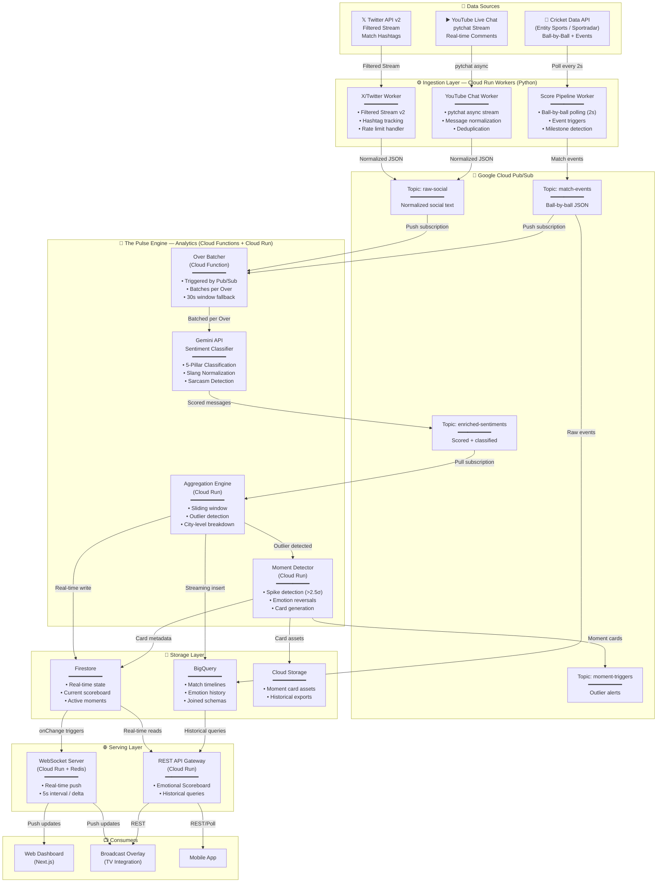
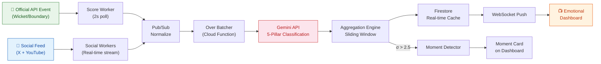
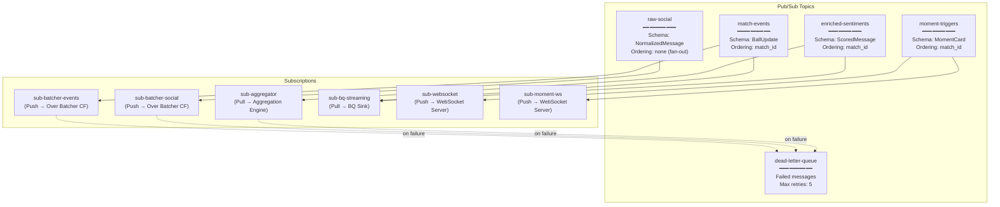
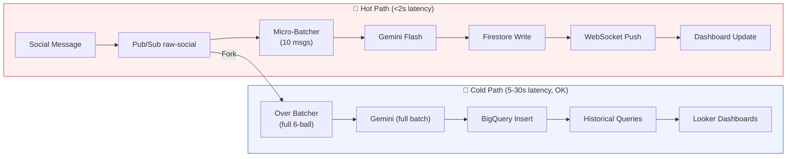
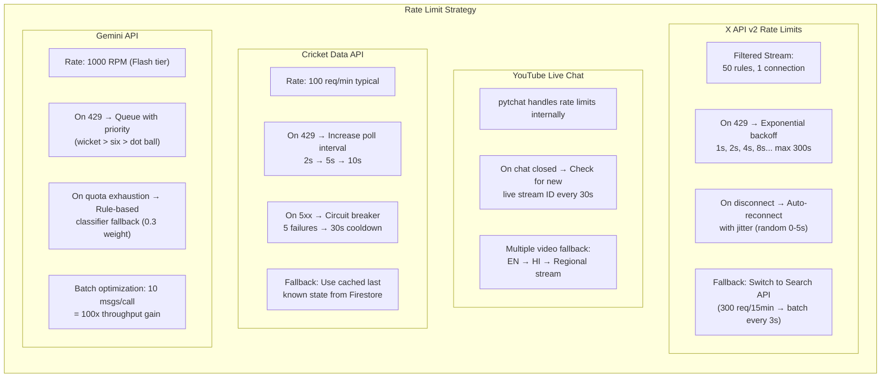
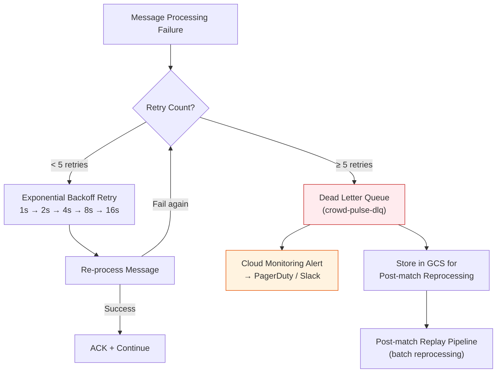
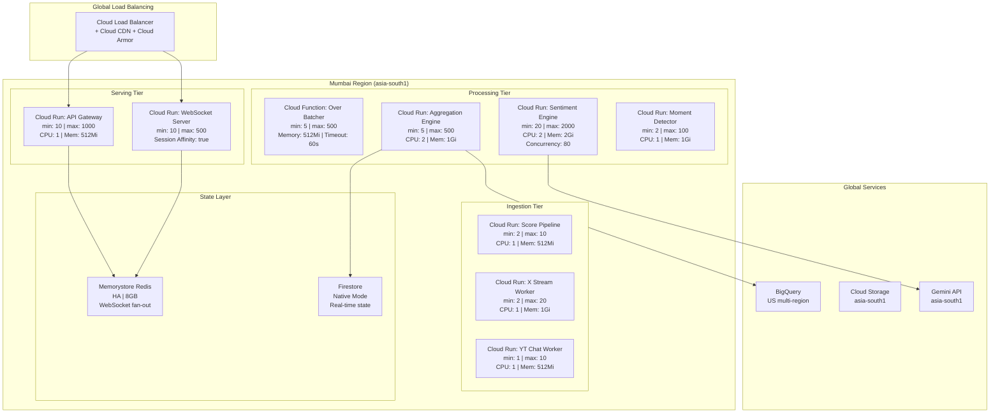

# Crowd Pulse — Complete Backend Architecture

> **Version:** 2.0 · **Last Updated:** 2026-04-22  
> **Author:** Lead Systems Architect  
> **Status:** Production-Ready Design Specification

---

## Table of Contents

1. [System Overview & Data Flow](#1-system-overview--end-to-end-data-flow)
2. [Data Ingestion Engine](#2-data-ingestion-engine)
3. [Data Orchestration — Pub/Sub Pipeline](#3-data-orchestration--pubsub-pipeline)
4. [The "Pulse" Engine — Analytics](#4-the-pulse-engine--analytics)
5. [Broadcast Integration API](#5-broadcast-integration-api)
6. [BigQuery Data Schemas](#6-bigquery-data-schemas)
7. [Latency Mitigation Plan](#7-latency-mitigation-plan--3-second-glass-to-glass)
8. [Error Handling & Resilience Strategy](#8-error-handling--resilience-strategy)
9. [Deployment Architecture](#9-deployment-architecture)

---

## 1. System Overview & End-to-End Data Flow

### 1.1 Master Architecture Flowchart



### 1.2 Simplified Event-to-Dashboard Path



---

## 2. Data Ingestion Engine

### 2.1 Score Pipeline Worker — Cricket Data API

This Python worker polls Entity Sports (or Sportradar) at a 2-second interval for ball-by-ball updates and detects key match events (wickets, boundaries, milestones).

```python
# backend/workers/score_pipeline.py

import asyncio
import json
import time
import logging
from datetime import datetime, timezone
from enum import Enum
from dataclasses import dataclass, asdict
from typing import Optional

import aiohttp
from google.cloud import pubsub_v1

# ─── Configuration ───────────────────────────────────────────
ENTITY_SPORT_API_KEY = "YOUR_ENTITY_SPORT_API_KEY"
ENTITY_SPORT_BASE_URL = "https://rest.entitysport.com/v2"
PROJECT_ID = "crowd-pulse-prod"
MATCH_EVENTS_TOPIC = f"projects/{PROJECT_ID}/topics/match-events"
POLL_INTERVAL_SECONDS = 2.0
MAX_RETRIES = 5
BACKOFF_BASE = 0.5

logging.basicConfig(level=logging.INFO, format="%(asctime)s [%(levelname)s] %(message)s")
logger = logging.getLogger("score_pipeline")


class MatchEvent(Enum):
    DOT = "dot"
    SINGLE = "single"
    DOUBLE = "double"
    TRIPLE = "triple"
    FOUR = "four"
    SIX = "six"
    WICKET = "wicket"
    WIDE = "wide"
    NO_BALL = "no_ball"
    OVER_END = "over_end"
    INNINGS_END = "innings_end"
    MILESTONE_50 = "milestone_50"
    MILESTONE_100 = "milestone_100"
    MAIDEN_OVER = "maiden_over"
    HAT_TRICK = "hat_trick"


@dataclass
class BallUpdate:
    match_id: str
    innings: int
    over: int
    ball: int
    runs_scored: int
    event_type: str
    batting_team: str
    bowling_team: str
    batsman: str
    bowler: str
    current_score: str          # e.g., "156/4"
    run_rate: float
    required_run_rate: Optional[float]
    target: Optional[int]
    is_free_hit: bool
    commentary: str
    timestamp_source: str       # ISO-8601
    timestamp_ingested: str     # ISO-8601


class ScorePipelineWorker:
    """
    High-frequency poller for cricket match data.
    Publishes ball-by-ball events to Pub/Sub topic `match-events`.
    """

    def __init__(self, match_id: str):
        self.match_id = match_id
        self.publisher = pubsub_v1.PublisherClient()
        self.session: Optional[aiohttp.ClientSession] = None
        self.last_ball_key = None          # Track "over.ball" to detect new deliveries
        self.consecutive_wickets = 0       # For hat-trick detection
        self.batsman_runs = {}             # Track milestones per batsman
        self.over_runs = 0                 # Track maiden overs
        self._running = False

    async def _create_session(self):
        timeout = aiohttp.ClientTimeout(total=5, connect=2)
        self.session = aiohttp.ClientSession(
            timeout=timeout,
            headers={"Authorization": f"token {ENTITY_SPORT_API_KEY}"}
        )

    async def _fetch_ball_by_ball(self) -> dict:
        """Fetch latest ball-by-ball data with exponential backoff."""
        url = f"{ENTITY_SPORT_BASE_URL}/matches/{self.match_id}/live"
        
        for attempt in range(MAX_RETRIES):
            try:
                async with self.session.get(url, params={"token": ENTITY_SPORT_API_KEY}) as resp:
                    if resp.status == 200:
                        data = await resp.json()
                        return data.get("response", {})
                    elif resp.status == 429:
                        # Rate limited — exponential backoff
                        wait_time = BACKOFF_BASE * (2 ** attempt)
                        logger.warning(f"Rate limited (429). Backing off {wait_time:.1f}s (attempt {attempt+1})")
                        await asyncio.sleep(wait_time)
                    elif resp.status >= 500:
                        logger.error(f"Server error {resp.status}. Retry {attempt+1}/{MAX_RETRIES}")
                        await asyncio.sleep(BACKOFF_BASE * (2 ** attempt))
                    else:
                        logger.error(f"Unexpected status {resp.status}: {await resp.text()}")
                        return {}
            except (aiohttp.ClientError, asyncio.TimeoutError) as e:
                logger.error(f"Network error: {e}. Retry {attempt+1}/{MAX_RETRIES}")
                await asyncio.sleep(BACKOFF_BASE * (2 ** attempt))

        logger.critical(f"All {MAX_RETRIES} retries exhausted for match {self.match_id}")
        return {}

    def _detect_events(self, ball_data: dict) -> list[str]:
        """Detect compound events: milestones, hat-tricks, maiden overs."""
        events = []
        runs = ball_data.get("runs", 0)
        is_wicket = ball_data.get("is_wicket", False)
        batsman = ball_data.get("batsman", {}).get("name", "Unknown")
        ball_num = ball_data.get("ball", 0)

        # Primary event
        if is_wicket:
            events.append(MatchEvent.WICKET.value)
            self.consecutive_wickets += 1
            if self.consecutive_wickets >= 3:
                events.append(MatchEvent.HAT_TRICK.value)
        else:
            self.consecutive_wickets = 0
            if runs == 0:
                events.append(MatchEvent.DOT.value)
            elif runs == 1:
                events.append(MatchEvent.SINGLE.value)
            elif runs == 2:
                events.append(MatchEvent.DOUBLE.value)
            elif runs == 3:
                events.append(MatchEvent.TRIPLE.value)
            elif runs == 4:
                events.append(MatchEvent.FOUR.value)
            elif runs == 6:
                events.append(MatchEvent.SIX.value)

        if ball_data.get("is_wide"):
            events.append(MatchEvent.WIDE.value)
        if ball_data.get("is_noball"):
            events.append(MatchEvent.NO_BALL.value)

        # Milestone detection
        batsman_total = ball_data.get("batsman", {}).get("runs", 0)
        prev_runs = self.batsman_runs.get(batsman, 0)
        if prev_runs < 50 <= batsman_total:
            events.append(MatchEvent.MILESTONE_50.value)
        if prev_runs < 100 <= batsman_total:
            events.append(MatchEvent.MILESTONE_100.value)
        self.batsman_runs[batsman] = batsman_total

        # Over tracking
        self.over_runs += runs
        if ball_num == 6:
            if self.over_runs == 0 and not is_wicket:
                events.append(MatchEvent.MAIDEN_OVER.value)
            events.append(MatchEvent.OVER_END.value)
            self.over_runs = 0

        return events

    def _build_ball_update(self, live_data: dict, ball_data: dict, events: list[str]) -> BallUpdate:
        """Construct a normalized BallUpdate from raw API data."""
        innings_data = live_data.get("live_innings", {})
        
        return BallUpdate(
            match_id=self.match_id,
            innings=live_data.get("live_innings_number", 1),
            over=ball_data.get("over", 0),
            ball=ball_data.get("ball", 0),
            runs_scored=ball_data.get("runs", 0),
            event_type="|".join(events),          # Pipe-delimited for compound events
            batting_team=innings_data.get("batting_team_short", ""),
            bowling_team=innings_data.get("bowling_team_short", ""),
            batsman=ball_data.get("batsman", {}).get("name", ""),
            bowler=ball_data.get("bowler", {}).get("name", ""),
            current_score=f"{innings_data.get('runs', 0)}/{innings_data.get('wickets', 0)}",
            run_rate=float(innings_data.get("run_rate", 0.0)),
            required_run_rate=float(innings_data.get("required_run_rate", 0)) or None,
            target=innings_data.get("target") or None,
            is_free_hit=ball_data.get("is_free_hit", False),
            commentary=ball_data.get("commentary", ""),
            timestamp_source=ball_data.get("timestamp", datetime.now(timezone.utc).isoformat()),
            timestamp_ingested=datetime.now(timezone.utc).isoformat(),
        )

    def _publish_to_pubsub(self, ball_update: BallUpdate):
        """Publish ball event to Pub/Sub with ordering key for sequencing."""
        data = json.dumps(asdict(ball_update)).encode("utf-8")
        future = self.publisher.publish(
            MATCH_EVENTS_TOPIC,
            data,
            match_id=self.match_id,
            event_type=ball_update.event_type,
            over=str(ball_update.over),
            ball=str(ball_update.ball),
        )
        future.add_done_callback(
            lambda f: logger.info(f"Published ball {ball_update.over}.{ball_update.ball}: {ball_update.event_type}")
            if not f.exception()
            else logger.error(f"Pub/Sub publish failed: {f.exception()}")
        )

    async def run(self):
        """Main polling loop."""
        await self._create_session()
        self._running = True
        logger.info(f"Score pipeline started for match {self.match_id}")

        try:
            while self._running:
                loop_start = time.monotonic()

                live_data = await self._fetch_ball_by_ball()
                if not live_data:
                    await asyncio.sleep(POLL_INTERVAL_SECONDS)
                    continue

                # Extract latest ball
                live_score = live_data.get("live_score", {})
                ball_key = f"{live_score.get('overs', '0')}"

                if ball_key != self.last_ball_key:
                    # New delivery detected
                    self.last_ball_key = ball_key
                    events = self._detect_events(live_score)
                    ball_update = self._build_ball_update(live_data, live_score, events)
                    self._publish_to_pubsub(ball_update)

                # Check if match is complete
                match_status = live_data.get("status_str", "")
                if match_status.lower() in ("completed", "abandoned", "no result"):
                    logger.info(f"Match {self.match_id} ended: {match_status}")
                    self._running = False
                    break

                # Maintain consistent polling interval
                elapsed = time.monotonic() - loop_start
                sleep_time = max(0, POLL_INTERVAL_SECONDS - elapsed)
                await asyncio.sleep(sleep_time)

        finally:
            await self.session.close()
            logger.info("Score pipeline stopped.")

    def stop(self):
        self._running = False


# ─── Entry Point ─────────────────────────────────────────────
if __name__ == "__main__":
    import sys
    match_id = sys.argv[1] if len(sys.argv) > 1 else "IPL2026_MI_CSK_052"
    worker = ScorePipelineWorker(match_id)
    asyncio.run(worker.run())
```

---

### 2.2 Social Pipeline — X API (Twitter v2) Filtered Stream

```python
# backend/workers/x_stream_worker.py

import asyncio
import json
import hashlib
import logging
from datetime import datetime, timezone
from typing import Optional

import aiohttp
from google.cloud import pubsub_v1

# ─── Configuration ───────────────────────────────────────────
X_BEARER_TOKEN = "YOUR_X_BEARER_TOKEN"
FILTERED_STREAM_URL = "https://api.twitter.com/2/tweets/search/stream"
STREAM_RULES_URL = "https://api.twitter.com/2/tweets/search/stream/rules"
PROJECT_ID = "crowd-pulse-prod"
RAW_SOCIAL_TOPIC = f"projects/{PROJECT_ID}/topics/raw-social"

# Rate limit tracking
RATE_LIMIT_WINDOW = 900            # 15 min window
MAX_RECONNECT_ATTEMPTS = 10
RECONNECT_BACKOFF_BASE = 1.0       # seconds

logging.basicConfig(level=logging.INFO, format="%(asctime)s [%(levelname)s] %(message)s")
logger = logging.getLogger("x_stream")


class XStreamWorker:
    """
    Connects to the X API v2 Filtered Stream endpoint and publishes
    match-specific tweets to Pub/Sub topic `raw-social` in the
    normalized schema: {timestamp, platform, city, raw_text}.
    """

    def __init__(self, match_id: str, hashtags: list[str]):
        self.match_id = match_id
        self.hashtags = hashtags              # e.g., ["#MIvCSK", "#IPL2026", "#CrowdPulse"]
        self.publisher = pubsub_v1.PublisherClient()
        self.session: Optional[aiohttp.ClientSession] = None
        self._running = False
        self._reconnect_count = 0
        self._message_count = 0
        self._rate_limit_remaining = None

    async def _create_session(self):
        self.session = aiohttp.ClientSession(
            headers={"Authorization": f"Bearer {X_BEARER_TOKEN}"},
            timeout=aiohttp.ClientTimeout(total=None, connect=10),
        )

    async def _setup_stream_rules(self):
        """Configure filtered stream rules for match-specific hashtags."""
        # 1. Delete existing rules
        async with self.session.get(STREAM_RULES_URL) as resp:
            existing = await resp.json()
            existing_ids = [r["id"] for r in existing.get("data", [])]
            if existing_ids:
                await self.session.post(
                    STREAM_RULES_URL,
                    json={"delete": {"ids": existing_ids}},
                )
                logger.info(f"Deleted {len(existing_ids)} existing stream rules")

        # 2. Add match-specific rules
        rules = [
            {
                "value": " OR ".join(self.hashtags) + " -is:retweet lang:en",
                "tag": f"match_{self.match_id}_en",
            },
            {
                "value": " OR ".join(self.hashtags) + " -is:retweet lang:hi",
                "tag": f"match_{self.match_id}_hi",
            },
            {
                "value": " OR ".join(self.hashtags) + " -is:retweet (lang:ta OR lang:te OR lang:bn)",
                "tag": f"match_{self.match_id}_regional",
            },
        ]

        async with self.session.post(STREAM_RULES_URL, json={"add": rules}) as resp:
            result = await resp.json()
            logger.info(f"Stream rules set: {json.dumps(result.get('meta', {}))}")

    def _normalize_tweet(self, tweet_data: dict) -> dict:
        """
        Normalize tweet to the unified social message schema:
        {timestamp, platform, city, raw_text}
        """
        tweet = tweet_data.get("data", {})
        includes = tweet_data.get("includes", {})
        
        # Extract city from user location (if available via expansions)
        city = None
        if includes.get("users"):
            location = includes["users"][0].get("location", "")
            city = self._extract_city_from_location(location)

        return {
            "message_id": f"x_{tweet.get('id', '')}",
            "match_id": self.match_id,
            "timestamp": tweet.get("created_at", datetime.now(timezone.utc).isoformat()),
            "platform": "twitter",
            "city": city,
            "raw_text": tweet.get("text", ""),
            "source_user_id": hashlib.sha256(
                tweet.get("author_id", "").encode()
            ).hexdigest()[:16],
            "detected_language": tweet_data.get("matching_rules", [{}])[0].get("tag", "").split("_")[-1],
            "metadata": json.dumps({
                "tweet_id": tweet.get("id"),
                "matching_rules": [r.get("tag") for r in tweet_data.get("matching_rules", [])],
                "public_metrics": tweet.get("public_metrics", {}),
            }),
        }

    def _extract_city_from_location(self, location_text: str) -> Optional[str]:
        """
        Best-effort city extraction from X profile location field.
        Falls back to None if unresolvable.
        """
        indian_cities = {
            "mumbai", "delhi", "bangalore", "bengaluru", "chennai", "kolkata",
            "hyderabad", "pune", "ahmedabad", "jaipur", "lucknow", "chandigarh",
            "indore", "kochi", "guwahati", "nagpur", "visakhapatnam",
        }
        if not location_text:
            return None

        location_lower = location_text.lower().strip()
        for city in indian_cities:
            if city in location_lower:
                return city.title()
        return None

    def _publish_to_pubsub(self, normalized: dict):
        """Publish normalized tweet to Pub/Sub."""
        data = json.dumps(normalized).encode("utf-8")
        future = self.publisher.publish(
            RAW_SOCIAL_TOPIC,
            data,
            match_id=self.match_id,
            platform="twitter",
        )
        self._message_count += 1
        if self._message_count % 100 == 0:
            logger.info(f"Published {self._message_count} tweets to Pub/Sub")

    async def _consume_stream(self):
        """
        Connect to the Filtered Stream and consume tweets.
        Uses chunked transfer encoding for real-time delivery.
        """
        params = {
            "tweet.fields": "created_at,author_id,public_metrics,lang",
            "user.fields": "location",
            "expansions": "author_id",
        }

        async with self.session.get(FILTERED_STREAM_URL, params=params) as resp:
            if resp.status == 429:
                retry_after = int(resp.headers.get("Retry-After", 60))
                logger.warning(f"X API rate limited. Waiting {retry_after}s")
                await asyncio.sleep(retry_after)
                return

            if resp.status != 200:
                logger.error(f"Stream error {resp.status}: {await resp.text()}")
                return

            self._reconnect_count = 0  # Reset on successful connection
            logger.info("Connected to X Filtered Stream")

            async for line in resp.content:
                if not self._running:
                    break

                line = line.strip()
                if not line:
                    continue  # Keep-alive heartbeat

                try:
                    tweet_data = json.loads(line)
                    normalized = self._normalize_tweet(tweet_data)
                    self._publish_to_pubsub(normalized)
                except json.JSONDecodeError:
                    logger.debug(f"Non-JSON line: {line[:100]}")
                except Exception as e:
                    logger.error(f"Error processing tweet: {e}", exc_info=True)

    async def run(self):
        """Main loop with automatic reconnection and backoff."""
        await self._create_session()
        await self._setup_stream_rules()
        self._running = True

        while self._running and self._reconnect_count < MAX_RECONNECT_ATTEMPTS:
            try:
                await self._consume_stream()
            except (aiohttp.ClientError, asyncio.TimeoutError) as e:
                self._reconnect_count += 1
                backoff = min(RECONNECT_BACKOFF_BASE * (2 ** self._reconnect_count), 300)
                logger.warning(
                    f"Stream disconnected: {e}. "
                    f"Reconnecting in {backoff:.0f}s (attempt {self._reconnect_count})"
                )
                await asyncio.sleep(backoff)
            except Exception as e:
                logger.critical(f"Unexpected error: {e}", exc_info=True)
                break

        if self.session:
            await self.session.close()
        logger.info(f"X Stream worker stopped. Total tweets processed: {self._message_count}")

    def stop(self):
        self._running = False


# ─── Entry Point ─────────────────────────────────────────────
if __name__ == "__main__":
    worker = XStreamWorker(
        match_id="IPL2026_MI_CSK_052",
        hashtags=["#MIvCSK", "#IPL2026", "#CrowdPulse", "#MI", "#CSK"],
    )
    asyncio.run(worker.run())
```

---

### 2.3 Social Pipeline — YouTube Live Chat (pytchat)

```python
# backend/workers/youtube_chat_worker.py

import asyncio
import json
import hashlib
import logging
from datetime import datetime, timezone
from typing import Optional

import pytchat
from google.cloud import pubsub_v1

# ─── Configuration ───────────────────────────────────────────
PROJECT_ID = "crowd-pulse-prod"
RAW_SOCIAL_TOPIC = f"projects/{PROJECT_ID}/topics/raw-social"
BATCH_SIZE = 25                     # Publish in micro-batches for throughput
BATCH_FLUSH_INTERVAL = 0.5         # Max seconds between flushes

logging.basicConfig(level=logging.INFO, format="%(asctime)s [%(levelname)s] %(message)s")
logger = logging.getLogger("yt_chat")


class YouTubeChatWorker:
    """
    Streams YouTube live chat comments using pytchat and publishes
    to Pub/Sub topic `raw-social` in the normalized JSON schema.

    Supports multiple concurrent video IDs (e.g., multiple broadcast
    languages of the same match).
    """

    def __init__(self, match_id: str, video_ids: list[str]):
        self.match_id = match_id
        self.video_ids = video_ids            # e.g., ["dQw4w9WgXcQ", "abc123def45"]
        self.publisher = pubsub_v1.PublisherClient()
        self._running = False
        self._message_count = 0
        self._seen_ids = set()                # Deduplication buffer (bounded LRU)
        self._MAX_SEEN = 100_000              # Max dedup buffer size
        self._batch_buffer: list[dict] = []

    def _normalize_chat_message(self, item, video_id: str) -> Optional[dict]:
        """
        Normalize a pytchat ChatData item to the unified schema:
        {timestamp, platform, city, raw_text}
        """
        # Deduplication
        msg_key = f"{item.author.channelId}_{item.message[:50]}"
        msg_hash = hashlib.md5(msg_key.encode()).hexdigest()
        if msg_hash in self._seen_ids:
            return None
        self._seen_ids.add(msg_hash)
        if len(self._seen_ids) > self._MAX_SEEN:
            # Evict oldest ~10% to prevent unbounded growth
            evict_count = self._MAX_SEEN // 10
            evict_keys = list(self._seen_ids)[:evict_count]
            for k in evict_keys:
                self._seen_ids.discard(k)

        return {
            "message_id": f"yt_{msg_hash}",
            "match_id": self.match_id,
            "timestamp": item.datetime if hasattr(item, 'datetime') 
                         else datetime.now(timezone.utc).isoformat(),
            "platform": "youtube",
            "city": None,                     # YouTube chat doesn't expose location
            "raw_text": item.message,
            "source_user_id": hashlib.sha256(
                item.author.channelId.encode()
            ).hexdigest()[:16],
            "detected_language": None,        # Detected downstream by Gemini
            "metadata": json.dumps({
                "video_id": video_id,
                "channel_name": item.author.name,
                "is_member": item.author.isChatModerator or item.author.isChatOwner,
                "type": item.type,
                "amount_string": getattr(item, 'amountString', None),
            }),
        }

    def _flush_batch(self):
        """Publish accumulated batch to Pub/Sub."""
        if not self._batch_buffer:
            return

        for msg in self._batch_buffer:
            data = json.dumps(msg).encode("utf-8")
            self.publisher.publish(
                RAW_SOCIAL_TOPIC,
                data,
                match_id=self.match_id,
                platform="youtube",
            )

        self._message_count += len(self._batch_buffer)
        if self._message_count % 500 == 0:
            logger.info(f"Published {self._message_count} YT chat messages")

        self._batch_buffer = []

    async def _stream_single_video(self, video_id: str):
        """Stream chat from a single YouTube video."""
        logger.info(f"Connecting to YouTube live chat: {video_id}")

        try:
            chat = pytchat.create(video_id=video_id)
        except Exception as e:
            logger.error(f"Failed to connect to YT chat {video_id}: {e}")
            return

        while self._running and chat.is_alive():
            try:
                for item in chat.get().sync_items():
                    normalized = self._normalize_chat_message(item, video_id)
                    if normalized:
                        self._batch_buffer.append(normalized)

                        if len(self._batch_buffer) >= BATCH_SIZE:
                            self._flush_batch()

                # Flush any remaining
                self._flush_batch()
                await asyncio.sleep(BATCH_FLUSH_INTERVAL)

            except Exception as e:
                logger.error(f"Error reading YT chat {video_id}: {e}")
                await asyncio.sleep(2)

        logger.info(f"YouTube chat stream ended: {video_id}")

    async def run(self):
        """Start streaming from all configured YouTube videos concurrently."""
        self._running = True
        logger.info(f"YouTube chat worker starting for {len(self.video_ids)} video(s)")

        tasks = [self._stream_single_video(vid) for vid in self.video_ids]
        await asyncio.gather(*tasks, return_exceptions=True)

        # Final flush
        self._flush_batch()
        logger.info(f"YouTube chat worker stopped. Total messages: {self._message_count}")

    def stop(self):
        self._running = False


# ─── Entry Point ─────────────────────────────────────────────
if __name__ == "__main__":
    worker = YouTubeChatWorker(
        match_id="IPL2026_MI_CSK_052",
        video_ids=["LIVE_VIDEO_ID_ENGLISH", "LIVE_VIDEO_ID_HINDI"],
    )
    asyncio.run(worker.run())
```

---

## 3. Data Orchestration — Pub/Sub Pipeline

### 3.1 Topic & Subscription Architecture



### 3.2 Normalized Social Message Schema

All incoming social text (from X, YouTube, or any future source) is normalized into this JSON schema before being published to the `raw-social` topic:

```json
{
  "message_id": "x_a1b2c3d4e5f6",
  "match_id": "IPL2026_MI_CSK_052",
  "timestamp": "2026-04-22T20:15:32.456Z",
  "platform": "twitter",
  "city": "Mumbai",
  "raw_text": "YESSSSS WHAT A SHOT 🔥🔥🔥 #MIvCSK",
  "source_user_id": "sha256_hash_16ch",
  "detected_language": "en",
  "metadata": "{\"tweet_id\": \"1234567890\", ...}"
}
```

| Field              | Type   | Required | Description                                        |
|--------------------|--------|----------|----------------------------------------------------|
| `message_id`       | string | ✅       | Globally unique ID, prefixed by platform            |
| `match_id`         | string | ✅       | Match identifier linking to score pipeline          |
| `timestamp`        | string | ✅       | ISO-8601 timestamp from source (or ingestion time)  |
| `platform`         | string | ✅       | `"twitter"`, `"youtube"`, `"whatsapp"`, `"web"`     |
| `city`             | string | ❌       | Detected city (best-effort, nullable)               |
| `raw_text`         | string | ✅       | Original unprocessed message text                   |
| `source_user_id`   | string | ❌       | SHA-256 hashed user identifier (privacy-safe)       |
| `detected_language`| string | ❌       | ISO 639-1 code if detected at ingestion             |
| `metadata`         | string | ❌       | JSON-serialized platform-specific metadata          |

### 3.3 Pub/Sub Terraform Configuration

```hcl
# infra/pubsub.tf

# ─── Dead Letter Topic ────────────────────────────────────────
resource "google_pubsub_topic" "dead_letter" {
  name    = "crowd-pulse-dlq"
  project = var.project_id
}

# ─── Match Events Topic ──────────────────────────────────────
resource "google_pubsub_topic" "match_events" {
  name    = "match-events"
  project = var.project_id

  message_retention_duration = "86400s"   # 24 hours

  schema_settings {
    schema   = google_pubsub_schema.ball_update.id
    encoding = "JSON"
  }
}

# ─── Raw Social Topic ────────────────────────────────────────
resource "google_pubsub_topic" "raw_social" {
  name    = "raw-social"
  project = var.project_id

  message_retention_duration = "86400s"
}

# ─── Enriched Sentiments Topic ───────────────────────────────
resource "google_pubsub_topic" "enriched_sentiments" {
  name    = "enriched-sentiments"
  project = var.project_id

  message_retention_duration = "86400s"
}

# ─── Moment Triggers Topic ───────────────────────────────────
resource "google_pubsub_topic" "moment_triggers" {
  name    = "moment-triggers"
  project = var.project_id

  message_retention_duration = "86400s"
}

# ─── Push Subscription → Over Batcher Cloud Function ─────────
resource "google_pubsub_subscription" "batcher_social" {
  name    = "sub-batcher-social"
  topic   = google_pubsub_topic.raw_social.id
  project = var.project_id

  push_config {
    push_endpoint = google_cloudfunctions2_function.over_batcher.url
    oidc_token {
      service_account_email = var.batcher_sa_email
    }
  }

  ack_deadline_seconds       = 30
  message_retention_duration = "600s"
  retain_acked_messages      = false

  dead_letter_policy {
    dead_letter_topic     = google_pubsub_topic.dead_letter.id
    max_delivery_attempts = 5
  }

  retry_policy {
    minimum_backoff = "1s"
    maximum_backoff = "60s"
  }
}

# ─── Pull Subscription → Aggregation Engine ──────────────────
resource "google_pubsub_subscription" "aggregator" {
  name    = "sub-aggregator"
  topic   = google_pubsub_topic.enriched_sentiments.id
  project = var.project_id

  ack_deadline_seconds       = 60
  message_retention_duration = "1200s"

  dead_letter_policy {
    dead_letter_topic     = google_pubsub_topic.dead_letter.id
    max_delivery_attempts = 5
  }
}
```

---

## 4. The "Pulse" Engine — Analytics

### 4.1 Over Batcher — Cloud Function (Triggered by Pub/Sub)

This Cloud Function receives individual social messages from Pub/Sub, buffers them per "Over," and on the 6th ball (over completion) or a 30-second timeout, flushes the batch to Gemini for multi-dimensional classification.

```python
# backend/functions/over_batcher/main.py

import json
import time
import base64
import logging
from datetime import datetime, timezone
from collections import defaultdict

import functions_framework
from google.cloud import firestore, pubsub_v1
import google.generativeai as genai

# ─── Configuration ───────────────────────────────────────────
PROJECT_ID = "crowd-pulse-prod"
ENRICHED_TOPIC = f"projects/{PROJECT_ID}/topics/enriched-sentiments"
GEMINI_MODEL = "gemini-2.0-flash"
MAX_BATCH_SIZE = 50                  # Max messages per Gemini call
OVER_TIMEOUT_SECONDS = 30           # Flush even if over isn't complete

logger = logging.getLogger("over_batcher")
db = firestore.Client(project=PROJECT_ID)
publisher = pubsub_v1.PublisherClient()

# Configure Gemini
genai.configure(api_key="YOUR_GEMINI_API_KEY")
model = genai.GenerativeModel(
    model_name=GEMINI_MODEL,
    system_instruction=SENTIMENT_SYSTEM_PROMPT,     # See §4.2
    generation_config=genai.GenerationConfig(
        response_mime_type="application/json",
        temperature=0.1,                             # Low temp for consistent scoring
    ),
)

# In-memory buffer (Cloud Function instance-level state)
# Key: (match_id, over_number) → list[dict]
_over_buffers = defaultdict(list)
_over_timestamps = {}


def _should_flush(match_id: str, over: int, is_over_end: bool) -> bool:
    """Determine if the current over buffer should be flushed to Gemini."""
    key = (match_id, over)
    buffer = _over_buffers[key]

    # Flush on over completion event
    if is_over_end:
        return True

    # Flush on batch size limit
    if len(buffer) >= MAX_BATCH_SIZE:
        return True

    # Flush on timeout (30s since first message in this over)
    first_ts = _over_timestamps.get(key)
    if first_ts and (time.time() - first_ts) > OVER_TIMEOUT_SECONDS:
        return True

    return False


def _classify_with_gemini(messages: list[dict], match_context: dict) -> list[dict]:
    """
    Send a batch of messages to Gemini for multi-dimensional 
    emotional classification using the 5-pillar framework.
    """
    prompt_input = {
        "messages": [
            {
                "id": m["message_id"],
                "text": m["raw_text"],
                "platform": m["platform"],
                "language": m.get("detected_language", "unknown"),
                "team_context": match_context.get("team_context", ""),
                "match_situation": match_context.get("match_situation", ""),
            }
            for m in messages
        ]
    }

    try:
        response = model.generate_content(json.dumps(prompt_input))
        result = json.loads(response.text)
        return result.get("results", [])
    except Exception as e:
        logger.error(f"Gemini classification failed: {e}")
        # Fallback: return neutral scores
        return [
            {
                "id": m["message_id"],
                "tension": 0.2, "euphoria": 0.2, "frustration": 0.2,
                "disbelief": 0.1, "jubilation": 0.1,
                "dominant_emotion": "tension", "confidence": 0.0,
                "is_sarcastic": False, "detected_team_affiliation": None,
            }
            for m in messages
        ]


def _get_match_context(match_id: str) -> dict:
    """Fetch current match state from Firestore for Gemini context."""
    try:
        doc = db.collection("matches").document(match_id).get()
        if doc.exists:
            data = doc.to_dict()
            return {
                "team_context": f"{data.get('batting_team', '')} vs {data.get('bowling_team', '')}",
                "match_situation": (
                    f"{data.get('current_score', '')}, "
                    f"Over {data.get('current_over', '')}, "
                    f"RRR: {data.get('required_run_rate', 'N/A')}"
                ),
            }
    except Exception as e:
        logger.warning(f"Failed to fetch match context: {e}")
    return {"team_context": "", "match_situation": ""}


def _publish_enriched(message: dict, scores: dict):
    """Publish classified message to enriched-sentiments topic."""
    enriched = {
        **message,
        "tension": scores.get("tension", 0),
        "euphoria": scores.get("euphoria", 0),
        "frustration": scores.get("frustration", 0),
        "disbelief": scores.get("disbelief", 0),
        "jubilation": scores.get("jubilation", 0),
        "dominant_emotion": scores.get("dominant_emotion", "tension"),
        "confidence": scores.get("confidence", 0),
        "is_sarcastic": scores.get("is_sarcastic", False),
        "detected_team_affiliation": scores.get("detected_team_affiliation"),
        "classified_at": datetime.now(timezone.utc).isoformat(),
    }

    data = json.dumps(enriched).encode("utf-8")
    publisher.publish(
        ENRICHED_TOPIC,
        data,
        match_id=message.get("match_id", ""),
        dominant_emotion=enriched["dominant_emotion"],
    )


@functions_framework.cloud_event
def over_batcher(cloud_event):
    """
    Cloud Function triggered by Pub/Sub.
    Receives raw social messages, buffers per over, and flushes
    batches to Gemini for classification.
    """
    # Decode Pub/Sub message
    data = base64.b64decode(cloud_event.data["message"]["data"])
    message = json.loads(data)
    attrs = cloud_event.data["message"].get("attributes", {})

    match_id = message.get("match_id", attrs.get("match_id", "unknown"))

    # Determine current over from Firestore match state
    match_ctx = _get_match_context(match_id)
    current_over = 0
    try:
        doc = db.collection("matches").document(match_id).get()
        if doc.exists:
            current_over = doc.to_dict().get("current_over", 0)
    except Exception:
        pass

    key = (match_id, current_over)
    is_over_end = message.get("event_type", "").endswith("over_end")

    # Buffer the message
    _over_buffers[key].append(message)
    if key not in _over_timestamps:
        _over_timestamps[key] = time.time()

    # Check if we should flush
    if _should_flush(match_id, current_over, is_over_end):
        buffer = _over_buffers.pop(key, [])
        _over_timestamps.pop(key, None)

        if not buffer:
            return

        logger.info(
            f"Flushing {len(buffer)} messages for {match_id} over {current_over}"
        )

        # Classify with Gemini (in sub-batches if needed)
        all_scores = []
        for i in range(0, len(buffer), MAX_BATCH_SIZE):
            chunk = buffer[i:i + MAX_BATCH_SIZE]
            scores = _classify_with_gemini(chunk, match_ctx)
            all_scores.extend(scores)

        # Build score lookup
        score_map = {s["id"]: s for s in all_scores}

        # Publish enriched messages
        for msg in buffer:
            scores = score_map.get(msg["message_id"], {})
            _publish_enriched(msg, scores)

        logger.info(f"Published {len(buffer)} enriched messages for over {current_over}")
```

### 4.2 Gemini System Prompt — Multi-Dimensional Classifier

```
SYSTEM PROMPT:
You are CrowdPulse Sentiment Engine, an expert in analyzing cricket fan emotions
during live IPL matches. You understand:

- Multi-lingual cricket vernacular (Hindi, Tamil, Telugu, Kannada, Bengali,
  Marathi, English, Hinglish)
- Cricket slang, abbreviations, and memes:
    • "thala for a reason" → jubilation/nostalgia for CSK fans
    • "RCB 49 PTSD" → frustration/disbelief for RCB fans
    • "intent™" → sarcastic frustration
    • "scriptwriters" → disbelief
    • "lessgooo" / "lessgoooo" → euphoria
    • "gg" → resignation (frustration)
    • "what a player" / "kya maaraaaa" → euphoria
    • "sack the coach" → intense frustration
- Sarcasm and irony common in cricket Twitter:
    • "Great captaincy 🤡" = FRUSTRATION, not euphoria
    • "Nice bowling 😂" after a six = FRUSTRATION, not euphoria  
    • "Just what we needed 💀" = sarcastic FRUSTRATION
    • Clown emoji (🤡) almost always inverts the literal meaning
- Team-specific fan cultures and rivalries
- Emoji-heavy communication patterns (emoji clusters amplify dominant emotion)
- Gen Z vernacular normalization:
    • "no cap" → genuine/sincere → amplify confidence
    • "fr fr" → sincerity marker
    • "lowkey" → moderate the score (-0.1)
    • "highkey" → amplify the score (+0.1)
    • "bussin" → euphoria
    • "mid" → mild frustration
    • "it's giving..." → context-dependent
    • "bruh" → disbelief or frustration
    • "W" / "massive W" → euphoria/jubilation
    • "L" / "massive L" → frustration
    • "ratio" → used to express disagreement (frustration)
    • "dead 💀" → disbelief (not literal)
    • "slay" → euphoria

CLASSIFICATION FRAMEWORK:
Score each message on these 5 emotional pillars (0.0 to 1.0, two decimal places):

1. TENSION: Anticipation, nervousness, nail-biting moments
   - Indicators: "can't watch", "heart rate 📈", "need 12 off 6", "kya hoga ab"
   - Amplifiers: chase scenarios, close margins, death overs
   
2. EUPHORIA: Pure joy, celebration, ecstasy triggered by a positive event
   - Indicators: "YESSSSS", "WHAT A SHOT", "kya maaraaaa", "🔥🔥🔥", "take a bow"
   - Amplifiers: sixes, boundaries, partnerships, milestones
   
3. FRUSTRATION: Anger, disappointment, criticism directed at team/player
   - Indicators: "why would you play that", "dropped again 🤦", "bekaar bowling"
   - Amplifiers: dot balls in death, dropped catches, poor shot selection
   
4. DISBELIEF: Shock, amazement at unexpected events (positive OR negative)
   - Indicators: "NO WAY", "how is that possible", "are you kidding me", "script writers 📝"
   - Amplifiers: hat-tricks, collapses, miraculous catches, impossible chases
   
5. JUBILATION: Triumphant celebration, vindication, team pride, finality
   - Indicators: "WE WON", "champions!", "legacy cemented", "apni team 💪"
   - Amplifiers: match-winning moments, trophies, season-defining performances

SCORING RULES:
- Multiple pillars CAN and SHOULD score high simultaneously
  (e.g., a last-ball six = tension:0.9, euphoria:0.95, disbelief:0.8, jubilation:0.85)
- Account for team affiliation context when match_situation is provided
- Neutral/irrelevant messages (spam, ads, unrelated) → all pillars < 0.1
- Sarcasm detection is CRITICAL — misclassifying sarcasm is the #1 error case
- ALL CAPS text = heightened intensity: +0.1 to +0.2 on dominant pillar
- Emoji clusters (3+) amplify the dominant emotion by +0.1
- Repeated characters ("YESSSSSS") amplify by +0.05 per repetition (cap at +0.2)
- The scores do NOT need to sum to 1.0 — they are independent dimensions

INPUT FORMAT:
{
  "messages": [
    {
      "id": "<message_id>",
      "text": "<raw_message_text>",
      "platform": "<twitter|youtube|whatsapp|web>",
      "language": "<detected_language>",
      "team_context": "<batting_team> vs <bowling_team>",
      "match_situation": "<current_score>, Over <overs>, RRR: <required_rr>"
    }
  ]
}

OUTPUT FORMAT (strict JSON, no markdown wrapping):
{
  "results": [
    {
      "id": "<message_id>",
      "tension": 0.00-1.00,
      "euphoria": 0.00-1.00,
      "frustration": 0.00-1.00,
      "disbelief": 0.00-1.00,
      "jubilation": 0.00-1.00,
      "dominant_emotion": "<pillar_name>",
      "confidence": 0.00-1.00,
      "is_sarcastic": true|false,
      "detected_team_affiliation": "<team_code|null>"
    }
  ]
}
```

### 4.3 Aggregation Engine — Sliding Window + Outlier Detection

```python
# backend/services/aggregation_engine.py

"""
Aggregation Engine (runs on Cloud Run).
Pulls from `enriched-sentiments` subscription, computes 30-second
sliding window aggregates, writes to BigQuery + Firestore,
and triggers Moment Cards on outliers.
"""

import json
import time
import statistics
import logging
from collections import defaultdict, deque
from datetime import datetime, timezone
from dataclasses import dataclass, field

from google.cloud import pubsub_v1, bigquery, firestore

# ─── Configuration ───────────────────────────────────────────
PROJECT_ID = "crowd-pulse-prod"
SUBSCRIPTION = f"projects/{PROJECT_ID}/subscriptions/sub-aggregator"
MOMENT_TOPIC = f"projects/{PROJECT_ID}/topics/moment-triggers"
BQ_DATASET = "crowd_pulse"
BQ_TABLE_AGG = "aggregated_emotions"
WINDOW_SIZE_SECONDS = 30
SLIDE_INTERVAL_SECONDS = 5
OUTLIER_SIGMA_THRESHOLD = 2.5
SPIKE_MIN_SCORE = 0.65
REVERSAL_DELTA_THRESHOLD = 0.4
SUSTAINED_SCORE_THRESHOLD = 0.8
SUSTAINED_WINDOW_COUNT = 3

logger = logging.getLogger("aggregator")
db = firestore.Client(project=PROJECT_ID)
bq_client = bigquery.Client(project=PROJECT_ID)
publisher = pubsub_v1.PublisherClient()

PILLARS = ["tension", "euphoria", "frustration", "disbelief", "jubilation"]


@dataclass
class EmotionWindow:
    """A time-bounded sliding window of emotion scores."""
    scores: dict = field(default_factory=lambda: {p: [] for p in PILLARS})
    messages: list = field(default_factory=list)
    start_time: float = 0.0
    end_time: float = 0.0
    cities: dict = field(default_factory=lambda: defaultdict(list))
    platforms: dict = field(default_factory=lambda: defaultdict(list))


class AggregationEngine:
    def __init__(self):
        self.subscriber = pubsub_v1.SubscriberClient()
        # Rolling history for outlier detection (last N windows)
        self.window_history: deque = deque(maxlen=30)  # ~5 overs of history
        self.current_window = EmotionWindow(start_time=time.time())
        self.prev_dominant = None

    def _add_to_window(self, message: dict):
        """Add a scored message to the current sliding window."""
        for pillar in PILLARS:
            score = message.get(pillar, 0)
            self.current_window.scores[pillar].append(score)

        self.current_window.messages.append(message)
        self.current_window.end_time = time.time()

        city = message.get("city")
        if city:
            self.current_window.cities[city].append(message)

        platform = message.get("platform", "unknown")
        self.current_window.platforms[platform].append(message)

    def _compute_aggregates(self) -> dict:
        """Compute aggregate scores for the current window."""
        window = self.current_window
        if not window.messages:
            return {}

        duration = max(window.end_time - window.start_time, 1)
        agg = {
            "interval_start": datetime.fromtimestamp(window.start_time, tz=timezone.utc).isoformat(),
            "interval_end": datetime.fromtimestamp(window.end_time, tz=timezone.utc).isoformat(),
            "interval_duration_s": int(duration),
            "message_count": len(window.messages),
            "unique_users": len(set(m.get("source_user_id", "") for m in window.messages)),
            "messages_per_second": round(len(window.messages) / duration, 2),
        }

        # Aggregate emotion scores (mean)
        for pillar in PILLARS:
            scores = window.scores[pillar]
            agg[f"{pillar}_score"] = round(statistics.mean(scores), 4) if scores else 0.0

        # Dominant emotion
        pillar_scores = {p: agg[f"{p}_score"] for p in PILLARS}
        dominant = max(pillar_scores, key=pillar_scores.get)
        agg["dominant_emotion"] = dominant
        agg["dominant_score"] = pillar_scores[dominant]

        # Platform breakdown
        agg["platform_breakdown"] = []
        for platform, msgs in window.platforms.items():
            pb = {"platform": platform, "count": len(msgs)}
            for pillar in PILLARS:
                p_scores = [m.get(pillar, 0) for m in msgs]
                pb[f"avg_{pillar}"] = round(statistics.mean(p_scores), 4) if p_scores else 0.0
            agg["platform_breakdown"].append(pb)

        # City breakdown
        agg["city_breakdown"] = []
        for city, msgs in window.cities.items():
            city_scores = {p: statistics.mean([m.get(p, 0) for m in msgs]) for p in PILLARS}
            city_dominant = max(city_scores, key=city_scores.get)
            agg["city_breakdown"].append({
                "city": city,
                "country": "IN",
                "count": len(msgs),
                "dominant_emotion": city_dominant,
                "dominant_score": round(city_scores[city_dominant], 4),
            })

        return agg

    def _detect_outliers(self, agg: dict) -> list[dict]:
        """
        Detect emotional outliers that should trigger Moment Cards.
        
        Trigger conditions:
        1. SPIKE:      Any pillar > 2.5σ above 5-over rolling mean AND score > 0.65
        2. REVERSAL:   Dominant emotion switches AND delta > 0.4
        3. SUSTAINED:  Any pillar > 0.8 for 3+ consecutive windows
        4. DIVERGENCE: City-level sentiment diverges > 0.5
        """
        triggers = []

        if len(self.window_history) < 3:
            return triggers

        # Compute rolling stats from history
        rolling_stats = {}
        for pillar in PILLARS:
            historical = [w.get(f"{pillar}_score", 0) for w in self.window_history]
            if len(historical) >= 2:
                rolling_stats[pillar] = {
                    "mean": statistics.mean(historical),
                    "stdev": max(statistics.stdev(historical), 0.05),
                }
            else:
                rolling_stats[pillar] = {"mean": 0.25, "stdev": 0.1}

        # 1. SPIKE detection
        for pillar in PILLARS:
            score = agg.get(f"{pillar}_score", 0)
            stats = rolling_stats[pillar]
            z_score = (score - stats["mean"]) / stats["stdev"]

            if z_score > OUTLIER_SIGMA_THRESHOLD and score > SPIKE_MIN_SCORE:
                triggers.append({
                    "trigger_type": "spike",
                    "affected_pillar": pillar,
                    "score": score,
                    "z_score": round(z_score, 2),
                    "baseline": round(stats["mean"], 4),
                })

        # 2. REVERSAL detection
        current_dominant = agg.get("dominant_emotion")
        if self.prev_dominant and current_dominant != self.prev_dominant:
            prev_score = list(self.window_history)[-1].get(f"{self.prev_dominant}_score", 0)
            curr_score = agg.get(f"{current_dominant}_score", 0)
            delta = abs(curr_score - prev_score)
            if delta > REVERSAL_DELTA_THRESHOLD:
                triggers.append({
                    "trigger_type": "reversal",
                    "from_emotion": self.prev_dominant,
                    "to_emotion": current_dominant,
                    "delta": round(delta, 4),
                })

        # 3. SUSTAINED detection
        for pillar in PILLARS:
            recent = [w.get(f"{pillar}_score", 0) for w in list(self.window_history)[-SUSTAINED_WINDOW_COUNT:]]
            if len(recent) >= SUSTAINED_WINDOW_COUNT and all(s > SUSTAINED_SCORE_THRESHOLD for s in recent):
                triggers.append({
                    "trigger_type": "sustained",
                    "affected_pillar": pillar,
                    "sustained_score": round(statistics.mean(recent), 4),
                    "window_count": SUSTAINED_WINDOW_COUNT,
                })

        # 4. DIVERGENCE detection (city vs city)
        city_breakdown = agg.get("city_breakdown", [])
        if len(city_breakdown) >= 2:
            for i, city_a in enumerate(city_breakdown):
                for city_b in city_breakdown[i+1:]:
                    if city_a["dominant_emotion"] != city_b["dominant_emotion"]:
                        divergence = abs(city_a["dominant_score"] - city_b["dominant_score"])
                        if divergence > 0.5:
                            triggers.append({
                                "trigger_type": "divergence",
                                "city_a": city_a["city"],
                                "city_b": city_b["city"],
                                "emotion_a": city_a["dominant_emotion"],
                                "emotion_b": city_b["dominant_emotion"],
                                "divergence": round(divergence, 4),
                            })

        self.prev_dominant = current_dominant
        return triggers

    def _write_to_bigquery(self, agg: dict, match_id: str, over: int):
        """Streaming insert to BigQuery aggregated_emotions table."""
        row = {**agg, "match_id": match_id, "over_number": over}
        table_ref = f"{PROJECT_ID}.{BQ_DATASET}.{BQ_TABLE_AGG}"
        errors = bq_client.insert_rows_json(table_ref, [row])
        if errors:
            logger.error(f"BQ insert errors: {errors}")

    def _write_to_firestore(self, agg: dict, match_id: str):
        """Write latest aggregate to Firestore for real-time reads."""
        doc_ref = db.collection("matches").document(match_id).collection("live").document("current")
        doc_ref.set({
            "emotions": {p: agg.get(f"{p}_score", 0) for p in PILLARS},
            "dominant": agg.get("dominant_emotion"),
            "dominant_score": agg.get("dominant_score", 0),
            "message_velocity": agg.get("messages_per_second", 0),
            "total_messages": agg.get("message_count", 0),
            "city_breakdown": agg.get("city_breakdown", []),
            "platform_breakdown": agg.get("platform_breakdown", []),
            "updated_at": firestore.SERVER_TIMESTAMP,
        }, merge=True)

    def _publish_moment_trigger(self, trigger: dict, match_id: str):
        """Publish moment trigger to Pub/Sub for Moment Detector."""
        data = json.dumps({**trigger, "match_id": match_id}).encode("utf-8")
        publisher.publish(
            MOMENT_TOPIC,
            data,
            match_id=match_id,
            trigger_type=trigger["trigger_type"],
        )
        logger.info(f"Moment triggered: {trigger['trigger_type']} for {match_id}")

    def _process_window(self, match_id: str, over: int):
        """Process, aggregate, detect, and emit results for a window."""
        agg = self._compute_aggregates()
        if not agg:
            return

        # Detect outliers
        triggers = self._detect_outliers(agg)
        for trigger in triggers:
            self._publish_moment_trigger(trigger, match_id)

        # Persist
        self._write_to_bigquery(agg, match_id, over)
        self._write_to_firestore(agg, match_id)

        # Advance history
        self.window_history.append(agg)

        # Reset window
        self.current_window = EmotionWindow(start_time=time.time())

    def callback(self, message):
        """Pub/Sub pull subscription callback."""
        try:
            data = json.loads(message.data.decode("utf-8"))
            match_id = data.get("match_id", "unknown")
            self._add_to_window(data)

            # Check if window should be flushed
            elapsed = time.time() - self.current_window.start_time
            if elapsed >= WINDOW_SIZE_SECONDS:
                over = data.get("over_number", 0)
                self._process_window(match_id, over)

            message.ack()
        except Exception as e:
            logger.error(f"Error processing message: {e}")
            message.nack()

    def run(self):
        """Start pulling from Pub/Sub."""
        streaming_pull = self.subscriber.subscribe(SUBSCRIPTION, callback=self.callback)
        logger.info("Aggregation engine started, listening for enriched sentiments...")

        try:
            streaming_pull.result()
        except KeyboardInterrupt:
            streaming_pull.cancel()
            streaming_pull.result()
```

---

## 5. Broadcast Integration API

### 5.1 OpenAPI Specification — Emotional Scoreboard

```yaml
openapi: 3.0.3
info:
  title: CrowdPulse Broadcast API
  version: 2.0.0
  description: |
    Real-time emotional scoreboard for broadcast overlay integration.
    Provides the current "Emotional Scoreboard" — a JSON payload of the
    top 3 emotions and the current match intensity score.

servers:
  - url: https://api.crowdpulse.live/v1
    description: Production
  - url: https://api-staging.crowdpulse.live/v1
    description: Staging

security:
  - BearerAuth: []

paths:
  /matches/{matchId}/scoreboard:
    get:
      operationId: getEmotionalScoreboard
      summary: Get current Emotional Scoreboard
      description: |
        Returns the current aggregated emotional state optimized for
        broadcast overlay rendering. Includes top 3 emotions, intensity
        score, and message velocity.
      parameters:
        - name: matchId
          in: path
          required: true
          schema:
            type: string
          example: "IPL2026_MI_CSK_052"
      responses:
        '200':
          description: Current emotional state
          headers:
            X-Pulse-Latency-Ms:
              schema:
                type: integer
              description: Server-side processing latency in milliseconds
            Cache-Control:
              schema:
                type: string
              description: "no-cache (always fresh)"
          content:
            application/json:
              schema:
                $ref: '#/components/schemas/EmotionalScoreboard'
              example:
                match_id: "IPL2026_MI_CSK_052"
                timestamp: "2026-04-22T20:15:32.456Z"
                over: 18
                ball: 4
                current_score: "156/4"
                intensity_score: 0.87
                intensity_label: "Explosive"
                top_emotions:
                  - emotion: "tension"
                    score: 0.91
                    delta: 0.15
                    trend: "up"
                    emoji: "😰"
                  - emotion: "euphoria"
                    score: 0.78
                    delta: 0.22
                    trend: "up"
                    emoji: "🤩"
                  - emotion: "disbelief"
                    score: 0.65
                    delta: 0.31
                    trend: "up"
                    emoji: "😱"
                all_emotions:
                  tension:
                    score: 0.91
                    delta: 0.15
                    trend: "up"
                    percentile: 97
                  euphoria:
                    score: 0.78
                    delta: 0.22
                    trend: "up"
                    percentile: 89
                  frustration:
                    score: 0.23
                    delta: -0.12
                    trend: "down"
                    percentile: 34
                  disbelief:
                    score: 0.65
                    delta: 0.31
                    trend: "up"
                    percentile: 92
                  jubilation:
                    score: 0.45
                    delta: 0.05
                    trend: "stable"
                    percentile: 67
                message_velocity: 8450
                total_messages: 1_250_000
                active_cities: 12
                trend: "rising"
        '404':
          description: Match not found
        '429':
          description: Rate limited

  /matches/{matchId}/scoreboard/stream:
    get:
      operationId: streamEmotionalScoreboard
      summary: WebSocket stream for real-time emotional updates
      description: |
        Upgrades to WebSocket connection.
        Pushes EmotionalScoreboard updates every 5 seconds
        OR immediately on significant emotional shift (>0.15 delta).
        
        Also pushes MomentCard events inline.
      parameters:
        - name: matchId
          in: path
          required: true
          schema:
            type: string

  /matches/{matchId}/moments:
    get:
      operationId: getMomentCards
      summary: Get triggered Moment Cards
      parameters:
        - name: matchId
          in: path
          required: true
          schema:
            type: string
        - name: since
          in: query
          schema:
            type: string
            format: date-time
          description: Return moments created after this timestamp
        - name: limit
          in: query
          schema:
            type: integer
            default: 10
            maximum: 50
      responses:
        '200':
          description: List of moment cards
          content:
            application/json:
              schema:
                type: object
                properties:
                  moments:
                    type: array
                    items:
                      $ref: '#/components/schemas/MomentCard'
                  total:
                    type: integer

components:
  securitySchemes:
    BearerAuth:
      type: http
      scheme: bearer
      bearerFormat: JWT

  schemas:
    EmotionalScoreboard:
      type: object
      required:
        - match_id
        - timestamp
        - intensity_score
        - top_emotions
      properties:
        match_id:
          type: string
        timestamp:
          type: string
          format: date-time
        over:
          type: integer
        ball:
          type: integer
        current_score:
          type: string
          description: "e.g., '156/4'"
        intensity_score:
          type: number
          format: float
          minimum: 0.0
          maximum: 1.0
          description: |
            Composite match intensity derived from:
            max(all_pillars) * 0.6 + messages_per_second_percentile * 0.3 + volatility * 0.1
        intensity_label:
          type: string
          enum: [Simmering, Building, Surging, Explosive, NUCLEAR]
        top_emotions:
          type: array
          maxItems: 3
          items:
            $ref: '#/components/schemas/TopEmotion'
          description: "Top 3 emotions sorted by score descending"
        all_emotions:
          type: object
          properties:
            tension:
              $ref: '#/components/schemas/EmotionPillar'
            euphoria:
              $ref: '#/components/schemas/EmotionPillar'
            frustration:
              $ref: '#/components/schemas/EmotionPillar'
            disbelief:
              $ref: '#/components/schemas/EmotionPillar'
            jubilation:
              $ref: '#/components/schemas/EmotionPillar'
        message_velocity:
          type: integer
          description: Messages processed per second
        total_messages:
          type: integer
          description: Total messages for this match
        active_cities:
          type: integer
          description: Number of cities actively contributing
        trend:
          type: string
          enum: [rising, stable, falling, volatile]

    TopEmotion:
      type: object
      properties:
        emotion:
          type: string
          enum: [tension, euphoria, frustration, disbelief, jubilation]
        score:
          type: number
          minimum: 0
          maximum: 1
        delta:
          type: number
          description: Change from previous 30s window
        trend:
          type: string
          enum: [up, down, stable]
        emoji:
          type: string

    EmotionPillar:
      type: object
      properties:
        score:
          type: number
          minimum: 0
          maximum: 1
        delta:
          type: number
        trend:
          type: string
          enum: [up, down, stable]
        percentile:
          type: integer
          minimum: 0
          maximum: 100
          description: Current score percentile vs match history

    MomentCard:
      type: object
      properties:
        moment_id:
          type: string
        title:
          type: string
          description: "Max 8 words, punchy headline"
        key_emotion:
          type: string
          enum: [tension, euphoria, frustration, disbelief, jubilation]
        emoji:
          type: string
        context:
          type: string
          description: "2-sentence context summary"
        fan_quote:
          type: string
        intensity_label:
          type: string
          enum: [Simmering, Building, Surging, Explosive, NUCLEAR]
        trigger_type:
          type: string
          enum: [spike, reversal, sustained, divergence]
        over:
          type: string
          description: "e.g., '18.4'"
        match_score:
          type: string
        timestamp:
          type: string
          format: date-time
        card_image_url:
          type: string
          format: uri
```

### 5.2 Example Emotional Scoreboard Response

```json
{
  "match_id": "IPL2026_MI_CSK_052",
  "timestamp": "2026-04-22T20:15:32.456Z",
  "over": 18,
  "ball": 4,
  "current_score": "156/4",
  "intensity_score": 0.87,
  "intensity_label": "Explosive",
  "top_emotions": [
    {
      "emotion": "tension",
      "score": 0.91,
      "delta": 0.15,
      "trend": "up",
      "emoji": "😰"
    },
    {
      "emotion": "euphoria",
      "score": 0.78,
      "delta": 0.22,
      "trend": "up",
      "emoji": "🤩"
    },
    {
      "emotion": "disbelief",
      "score": 0.65,
      "delta": 0.31,
      "trend": "up",
      "emoji": "😱"
    }
  ],
  "all_emotions": {
    "tension": { "score": 0.91, "delta": 0.15, "trend": "up", "percentile": 97 },
    "euphoria": { "score": 0.78, "delta": 0.22, "trend": "up", "percentile": 89 },
    "frustration": { "score": 0.23, "delta": -0.12, "trend": "down", "percentile": 34 },
    "disbelief": { "score": 0.65, "delta": 0.31, "trend": "up", "percentile": 92 },
    "jubilation": { "score": 0.45, "delta": 0.05, "trend": "stable", "percentile": 67 }
  },
  "message_velocity": 8450,
  "total_messages": 1250000,
  "active_cities": 12,
  "trend": "rising"
}
```

---

## 6. BigQuery Data Schemas

### 6.1 Match Events Table (Cricket API Data)

```sql
CREATE TABLE crowd_pulse.match_events (
    event_id            STRING        NOT NULL,   -- UUID v7
    match_id            STRING        NOT NULL,   -- e.g., "IPL2026_MI_CSK_052"
    innings             INT64         NOT NULL,   -- 1 or 2
    over_number         INT64         NOT NULL,   -- 0-19
    ball_number         INT64         NOT NULL,   -- 1-6
    
    -- Event data
    event_type          STRING        NOT NULL,   -- 'dot','single','four','six','wicket','wide','no_ball'
    compound_events     ARRAY<STRING>,             -- Additional: 'milestone_50','hat_trick','maiden_over'
    runs_scored         INT64         NOT NULL,
    
    -- Match state at this ball
    batting_team        STRING        NOT NULL,
    bowling_team        STRING        NOT NULL,
    batsman             STRING,
    bowler              STRING,
    current_score       STRING        NOT NULL,   -- "156/4"
    total_runs          INT64         NOT NULL,
    total_wickets       INT64         NOT NULL,
    run_rate            FLOAT64,
    required_run_rate   FLOAT64,                   -- NULL in 1st innings
    target              INT64,                     -- NULL in 1st innings
    is_free_hit         BOOL          DEFAULT FALSE,
    
    -- Textual context
    commentary          STRING,
    
    -- Timestamps
    timestamp_source    TIMESTAMP     NOT NULL,   -- When it happened (from API)
    timestamp_ingested  TIMESTAMP     NOT NULL,   -- When we received it

    -- Processing metadata
    api_source          STRING        DEFAULT 'entity_sport',
    api_latency_ms      INT64,                     -- Measure API response time
)
PARTITION BY DATE(timestamp_source)
CLUSTER BY match_id, over_number;
```

### 6.2 Raw Social Messages Table

```sql
CREATE TABLE crowd_pulse.raw_messages (
    message_id          STRING        NOT NULL,   -- Platform-prefixed unique ID
    match_id            STRING        NOT NULL,
    source_platform     STRING        NOT NULL,   -- 'twitter', 'youtube', 'whatsapp', 'web'
    source_user_id      STRING,                    -- SHA-256 hashed (privacy-safe)
    raw_text            STRING        NOT NULL,
    detected_language   STRING,                    -- ISO 639-1
    
    -- Geolocation (best-effort)
    geo_city            STRING,
    geo_country         STRING        DEFAULT 'IN',
    geo_source          STRING,                    -- 'profile', 'linguistic', 'ip'
    
    -- Timestamps
    timestamp_source    TIMESTAMP,                 -- Original post time
    timestamp_ingested  TIMESTAMP     NOT NULL,
    
    -- Platform-specific metadata
    metadata            JSON,
)
PARTITION BY DATE(timestamp_ingested)
CLUSTER BY match_id, source_platform;
```

### 6.3 Enriched Sentiments Table (Post-Gemini Classification)

```sql
CREATE TABLE crowd_pulse.enriched_sentiments (
    message_id          STRING        NOT NULL,   -- FK → raw_messages
    match_id            STRING        NOT NULL,
    over_number         INT64,                     -- Which over this message belongs to
    
    -- Five Emotional Pillars (0.0 to 1.0)
    tension_score       FLOAT64       NOT NULL,
    euphoria_score      FLOAT64       NOT NULL,
    frustration_score   FLOAT64       NOT NULL,
    disbelief_score     FLOAT64       NOT NULL,
    jubilation_score    FLOAT64       NOT NULL,
    
    -- Classification metadata
    dominant_emotion    STRING        NOT NULL,
    confidence          FLOAT64       NOT NULL,
    is_sarcastic        BOOL          DEFAULT FALSE,
    detected_team       STRING,                    -- Team affiliation code
    
    -- Processing metadata
    gemini_model        STRING        DEFAULT 'gemini-2.0-flash',
    classification_latency_ms INT64,
    batch_id            STRING,                    -- Which batch this was classified in
    
    -- Timestamps
    timestamp_classified TIMESTAMP    NOT NULL,
)
PARTITION BY DATE(timestamp_classified)
CLUSTER BY match_id, over_number, dominant_emotion;
```

### 6.4 Aggregated Emotions Table (Per-Over/Window Summaries)

```sql
CREATE TABLE crowd_pulse.aggregated_emotions (
    agg_id              STRING        NOT NULL,
    match_id            STRING        NOT NULL,
    over_number         INT64         NOT NULL,
    ball_number         INT64,                     -- NULL for over-level aggregates
    interval_start      TIMESTAMP     NOT NULL,
    interval_end        TIMESTAMP     NOT NULL,
    interval_duration_s INT64         NOT NULL,
    
    -- Five Emotional Pillars (aggregated 0.0 to 1.0)
    tension_score       FLOAT64       NOT NULL,
    euphoria_score      FLOAT64       NOT NULL,
    frustration_score   FLOAT64       NOT NULL,
    disbelief_score     FLOAT64       NOT NULL,
    jubilation_score    FLOAT64       NOT NULL,
    
    -- Dominant
    dominant_emotion    STRING        NOT NULL,
    dominant_score      FLOAT64       NOT NULL,
    
    -- Volume metrics
    message_count       INT64         NOT NULL,
    unique_users        INT64         NOT NULL,
    messages_per_second FLOAT64       NOT NULL,
    
    -- Nested breakdowns
    platform_breakdown  ARRAY<STRUCT<
        platform        STRING,
        count           INT64,
        avg_tension     FLOAT64,
        avg_euphoria    FLOAT64,
        avg_frustration FLOAT64,
        avg_disbelief   FLOAT64,
        avg_jubilation  FLOAT64
    >>,
    city_breakdown      ARRAY<STRUCT<
        city            STRING,
        country         STRING,
        count           INT64,
        dominant_emotion STRING,
        dominant_score  FLOAT64
    >>,
    
    -- Match context (JOIN from match_events)
    match_event         STRING,
    batting_team        STRING,
    bowling_team        STRING,
    current_score       STRING,
    run_rate            FLOAT64,
    required_run_rate   FLOAT64,
    
    -- Processing metadata
    processing_latency_ms INT64,
    gemini_model_version  STRING,
    timestamp_created   TIMESTAMP     NOT NULL DEFAULT CURRENT_TIMESTAMP()
)
PARTITION BY DATE(interval_start)
CLUSTER BY match_id, over_number;
```

### 6.5 JOIN Query — Match Events × Sentiment Results

This is the key schema join that correlates what happened on the field with how fans reacted:

```sql
-- ═══════════════════════════════════════════════════════════════
-- Query: Join match events with aggregated sentiment for each over
-- Use case: "What was the emotional reaction to each ball/event?"
-- ═══════════════════════════════════════════════════════════════

SELECT
    me.match_id,
    me.innings,
    me.over_number,
    me.ball_number,
    me.event_type,
    me.batsman,
    me.bowler,
    me.current_score,
    me.runs_scored,
    me.run_rate,
    me.required_run_rate,
    me.commentary,
    
    -- Emotional reaction to this event
    ae.tension_score,
    ae.euphoria_score,
    ae.frustration_score,
    ae.disbelief_score,
    ae.jubilation_score,
    ae.dominant_emotion,
    ae.dominant_score,
    ae.message_count           AS social_volume,
    ae.messages_per_second     AS social_velocity,
    ae.unique_users,
    
    -- Time correlation
    me.timestamp_source        AS event_time,
    ae.interval_start          AS sentiment_window_start,
    ae.interval_end            AS sentiment_window_end,
    
    -- Latency between event and sentiment capture
    TIMESTAMP_DIFF(ae.interval_start, me.timestamp_source, SECOND) AS reaction_delay_s,
    
    -- City-level breakdown (unnested for analysis)
    ae.city_breakdown,
    ae.platform_breakdown

FROM
    `crowd_pulse.match_events` me

LEFT JOIN
    `crowd_pulse.aggregated_emotions` ae
ON
    me.match_id = ae.match_id
    AND me.over_number = ae.over_number
    -- Temporal join: sentiment window must start within 60s of the event
    AND ae.interval_start BETWEEN 
        me.timestamp_source 
        AND TIMESTAMP_ADD(me.timestamp_source, INTERVAL 60 SECOND)

WHERE
    me.match_id = 'IPL2026_MI_CSK_052'

ORDER BY
    me.innings, me.over_number, me.ball_number;


-- ═══════════════════════════════════════════════════════════════
-- Query: Find the most emotionally charged moments of a match
-- ═══════════════════════════════════════════════════════════════

SELECT
    me.over_number,
    me.ball_number,
    me.event_type,
    me.batsman,
    me.current_score,
    ae.dominant_emotion,
    ae.dominant_score,
    ae.messages_per_second,
    ae.message_count,
    
    -- Composite intensity rank
    (ae.dominant_score * 0.6 + 
     SAFE_DIVIDE(ae.messages_per_second, 10000) * 0.3 +
     GREATEST(ae.tension_score, ae.euphoria_score, ae.frustration_score, 
              ae.disbelief_score, ae.jubilation_score) * 0.1
    ) AS intensity_rank

FROM `crowd_pulse.match_events` me
JOIN `crowd_pulse.aggregated_emotions` ae
    ON me.match_id = ae.match_id
    AND me.over_number = ae.over_number
    AND ae.interval_start BETWEEN 
        me.timestamp_source 
        AND TIMESTAMP_ADD(me.timestamp_source, INTERVAL 60 SECOND)

WHERE me.match_id = 'IPL2026_MI_CSK_052'
  AND me.event_type IN ('wicket', 'six', 'four', 'milestone_50', 'milestone_100')

ORDER BY intensity_rank DESC
LIMIT 10;
```

### 6.6 Entity Relationship Diagram

```mermaid
erDiagram
    MATCH_EVENTS ||--o{ AGGREGATED_EMOTIONS : "over_number + temporal"
    RAW_MESSAGES ||--|| ENRICHED_SENTIMENTS : "message_id"
    ENRICHED_SENTIMENTS }o--|| AGGREGATED_EMOTIONS : "over_number window"
    AGGREGATED_EMOTIONS ||--o{ MOMENT_CARDS : "triggers"
    
    MATCH_EVENTS {
        string event_id PK
        string match_id FK
        int innings
        int over_number
        int ball_number
        string event_type
        string current_score
        int runs_scored
        string batting_team
        timestamp timestamp_source
    }
    
    RAW_MESSAGES {
        string message_id PK
        string match_id FK
        string source_platform
        string raw_text
        string geo_city
        timestamp timestamp_ingested
    }
    
    ENRICHED_SENTIMENTS {
        string message_id PK_FK
        string match_id FK
        int over_number
        float tension_score
        float euphoria_score
        float frustration_score
        float disbelief_score
        float jubilation_score
        string dominant_emotion
        bool is_sarcastic
    }
    
    AGGREGATED_EMOTIONS {
        string agg_id PK
        string match_id FK
        int over_number
        float tension_score
        float euphoria_score
        float frustration_score
        float disbelief_score
        float jubilation_score
        string dominant_emotion
        int message_count
        float messages_per_second
    }
    
    MOMENT_CARDS {
        string moment_id PK
        string match_id FK
        string trigger_type
        string key_emotion
        float emotion_intensity
        string title
        string context_summary
    }
```

---

## 7. Latency Mitigation Plan — <3-Second Glass-to-Glass

### 7.1 Latency Budget Breakdown

```mermaid
gantt
    title Glass-to-Glass Latency Budget (Target <3000ms)
    dateFormat X
    axisFormat %Lms

    section 1. Ingestion
    Social API Receipt           :a1, 0, 100
    Pub/Sub Publish + Deliver    :a2, 100, 200

    section 2. Batching
    Over Batcher Buffer (bypass) :b0, 200, 250
    
    section 3. Classification
    Gemini Flash API Call        :b1, 250, 900
    
    section 4. Aggregation
    Window Aggregate Compute     :b2, 900, 1100
    
    section 5. Storage
    Firestore Write              :c1, 1100, 1300
    BigQuery Streaming (async)   :c2, 1100, 1500

    section 6. Delivery
    Firestore onChange → WS Push :d1, 1300, 1500
    WebSocket Transport          :d2, 1500, 1650
    Client Render (RAF)          :d3, 1650, 1800
```



**Total: ~1800ms typical, 1200ms buffer for spikes**

### 7.2 Strategy Details

| Stage | Budget | Strategy | Why It Works |
|---|---|---|---|
| **Ingestion** | <200ms | Cloud Run workers with `min-instances: 10` eliminate cold starts. X API uses Filtered Stream (pushed, not polled). pytchat runs in-process. | Zero cold-start + push model = near-instant receipt |
| **Pub/Sub** | <50ms | Pub/Sub topic in `asia-south1` (same region as workers). Push subscriptions for latency-critical paths. | Intra-region publish is <20ms p99 |
| **Batching** | <50ms | **Hot-path bypass**: For real-time dashboard, messages flow through a "micro-batch" of 10 messages (not a full over). Full over batching is used for BigQuery analytics only. | Dashboard gets sub-second updates; analytics gets clean per-over data |
| **Gemini Classification** | <650ms | Gemini 2.0 Flash with `response_mime_type: "application/json"` and `temperature: 0.1`. Batch 10 messages per call to amortize latency. | Flash model: ~150ms/message → ~300ms for 10-message batch |
| **Aggregation** | <200ms | In-memory sliding window in Cloud Run (stateful). No external state store reads during aggregation. Rolling stats computed incrementally. | Hot state in process memory, O(1) incremental update |
| **Firestore Write** | <200ms | Single document write with `merge: true`. Document path pre-determined (`matches/{id}/live/current`). | Firestore writes in same region: <100ms p95 |
| **BQ Insert** | Async | BigQuery streaming insert is **fire-and-forget** (not on critical path). 5-second flush intervals. | Does not block dashboard latency |
| **WebSocket Push** | <150ms | Firestore `onSnapshot` triggers push via Cloud Run WebSocket server. Redis Pub/Sub for multi-instance fan-out. | Direct push, no polling |
| **Client Render** | <150ms | `requestAnimationFrame` for DOM updates. Incremental state diffs (only changed pillars). CSS transitions for smooth visual updates. | 60fps render pipeline |

### 7.3 Hot-Path vs Cold-Path Architecture



### 7.4 Infrastructure Pre-warming Protocol

```
T-60min: Cloud Scheduler triggers pre-warm job
   ├─ Scale Cloud Run Sentiment Engine to 20 instances
   ├─ Scale Cloud Run WebSocket Server to 10 instances
   ├─ Warm Gemini connection pool (10 pre-authenticated sessions)
   └─ Pre-populate Firestore match document with initial state

T-30min: Ingestion workers start
   ├─ Score Pipeline connects to Cricket API
   ├─ X Stream establishes Filtered Stream connection
   ├─ YouTube Chat worker connects to live stream(s)
   └─ Health-check: Pub/Sub publish test messages, verify round-trip

T-5min:  Load test
   ├─ Synthetic 1000-message burst through pipeline
   ├─ Verify <2s end-to-end latency
   └─ If latency > 2.5s: auto-scale +50% instances

T-0:     Match starts → full pipeline active
```

---

## 8. Error Handling & Resilience Strategy

### 8.1 API Rate Limit Handling



### 8.2 Circuit Breaker Implementation

```python
# backend/lib/circuit_breaker.py

import time
import logging
from enum import Enum
from dataclasses import dataclass, field
from typing import Callable, Any

logger = logging.getLogger("circuit_breaker")


class CircuitState(Enum):
    CLOSED = "closed"        # Normal operation
    OPEN = "open"            # Failing, reject fast
    HALF_OPEN = "half_open"  # Testing recovery


@dataclass
class CircuitBreaker:
    """
    Circuit breaker for external API calls during high-traffic moments.
    
    Usage:
        cb = CircuitBreaker(name="gemini", failure_threshold=5, recovery_timeout=30)
        result = cb.call(gemini_classify, messages)
    """
    name: str
    failure_threshold: int = 5           # Failures before opening circuit
    recovery_timeout: float = 30.0       # Seconds before trying half-open
    success_threshold: int = 3           # Successes needed to close from half-open

    state: CircuitState = field(default=CircuitState.CLOSED)
    failure_count: int = field(default=0)
    success_count: int = field(default=0)
    last_failure_time: float = field(default=0.0)
    total_rejected: int = field(default=0)

    def call(self, func: Callable, *args, fallback: Callable = None, **kwargs) -> Any:
        """Execute function through the circuit breaker."""
        
        if self.state == CircuitState.OPEN:
            # Check if recovery timeout has elapsed
            if time.time() - self.last_failure_time >= self.recovery_timeout:
                logger.info(f"[{self.name}] Circuit HALF_OPEN — testing recovery")
                self.state = CircuitState.HALF_OPEN
                self.success_count = 0
            else:
                self.total_rejected += 1
                if fallback:
                    logger.debug(f"[{self.name}] Circuit OPEN — using fallback")
                    return fallback(*args, **kwargs)
                raise CircuitOpenError(
                    f"Circuit breaker [{self.name}] is OPEN. "
                    f"Rejected {self.total_rejected} calls. "
                    f"Recovery in {self.recovery_timeout - (time.time() - self.last_failure_time):.0f}s"
                )

        try:
            result = func(*args, **kwargs)
            self._on_success()
            return result
        except Exception as e:
            self._on_failure()
            if fallback:
                return fallback(*args, **kwargs)
            raise

    def _on_success(self):
        if self.state == CircuitState.HALF_OPEN:
            self.success_count += 1
            if self.success_count >= self.success_threshold:
                logger.info(f"[{self.name}] Circuit CLOSED — recovered")
                self.state = CircuitState.CLOSED
                self.failure_count = 0
                self.total_rejected = 0

    def _on_failure(self):
        self.failure_count += 1
        self.last_failure_time = time.time()

        if self.state == CircuitState.HALF_OPEN:
            logger.warning(f"[{self.name}] Circuit OPEN — recovery failed")
            self.state = CircuitState.OPEN

        elif self.failure_count >= self.failure_threshold:
            logger.warning(
                f"[{self.name}] Circuit OPEN — {self.failure_count} consecutive failures"
            )
            self.state = CircuitState.OPEN


class CircuitOpenError(Exception):
    pass
```

### 8.3 Priority Queue for Rate-Limited Scenarios

During a last-ball finish, social volume can spike 50-100x. When Gemini API rate limits are hit, messages are prioritized:

| Priority | Event Type | Rationale |
|---|---|---|
| **P0 — Critical** | Wickets, Hat-tricks | Match-changing, highest emotional signal |
| **P1 — High** | Sixes, Milestones (50/100) | Strong emotional triggers |
| **P2 — Medium** | Fours, Close-call events | Moderate emotional signal |
| **P3 — Low** | Dots, Singles, Doubles | Background noise, can be batched or sampled |
| **P4 — Deferrable** | Neutral/spam messages | Classify later or discard |

```python
# Priority-based message sampling during rate limit
def sample_under_pressure(messages: list[dict], max_batch: int) -> list[dict]:
    """
    When rate-limited, intelligently sample messages to maximize
    emotional signal within the available API budget.
    """
    # Priority scoring heuristic (no API call needed)
    def priority_score(msg: dict) -> float:
        text = msg.get("raw_text", "").lower()
        score = 0.0
        
        # High-emotion indicators
        if any(w in text for w in ["wicket", "out", "bowled", "caught"]):
            score += 10
        if any(w in text for w in ["six", "sixer", "🔥🔥"]):
            score += 8
        if text.isupper() and len(text) > 10:    # ALL CAPS
            score += 5
        if text.count("!") > 2:                   # Exclamation clusters
            score += 3
        emoji_count = sum(1 for c in text if ord(c) > 0x1F600)
        score += min(emoji_count, 5)               # Emoji density
        
        # Penalize likely spam/neutral
        if len(text) < 5:
            score -= 5
        if text.startswith("http"):
            score -= 10
        
        return score
    
    # Sort by priority and take top N
    scored = sorted(messages, key=priority_score, reverse=True)
    return scored[:max_batch]
```

### 8.4 Dead Letter Queue & Monitoring



### 8.5 Failure Mode Matrix

| Failure Scenario | Impact | Detection | Mitigation |
|---|---|---|---|
| **Cricket API down** | No score updates | Health check fails 3x | Cache last state in Firestore; display "Score delayed" badge |
| **X API rate limited** | Reduced tweet volume | 429 response code | Exponential backoff; switch to Search API polling; sample top tweets |
| **YouTube stream ends** | No YT chat data | pytchat `is_alive()` = false | Auto-retry with new video ID lookup every 30s |
| **Gemini API quota hit** | No sentiment scoring | 429/ResourceExhausted | Circuit breaker → rule-based classifier fallback (keyword + emoji) |
| **Pub/Sub publish fails** | Message loss | Publish callback error | Local buffer with retry; DLQ after 5 failures |
| **Firestore write fails** | Stale dashboard | Write exception | Retry 3x → log error → continue (dashboard shows last good state) |
| **BigQuery streaming error** | Analytics gap | Insert error response | Buffer in Cloud Storage → batch load post-match |
| **WebSocket disconnect** | Client not updating | Heartbeat timeout | Client auto-reconnect with exponential backoff; SSE fallback |
| **Cloud Run scaling delay** | Increased latency | p99 latency > 2s | Pre-warm instances; min-instances=10 for critical services |
| **Full pipeline failure** | Dashboard frozen | End-to-end health check | Display "Reconnecting..." UI; fall back to simulator data |

---

## 9. Deployment Architecture

### 9.1 Infrastructure Topology



### 9.2 Auto-Scaling Strategy

| Phase | Trigger | Instance Count | Throughput |
|---|---|---|---|
| **Idle** | No active match | 0 (scale to zero) | 0 msg/s |
| **Pre-match** | T-60min scheduler | 50 base | ~10K msg/s |
| **Match Active** | CPU > 60% | 200 instances | ~100K msg/s |
| **Death Overs** | CPU > 80% OR msg/s > 50K | 1000 instances | ~500K msg/s |
| **Last Over / Finish** | Message velocity spike >5x | 2000 instances | ~1M msg/s |
| **Post-match** | Gradual cooldown (15min) | Scale down to 50 → 0 | Decreasing |

### 9.3 Cost Optimization

- **Scale-to-zero** between matches (saves ~$400/day idle cost)
- **Pre-warm** instances 60 min before match via Cloud Scheduler
- **Batch Gemini calls** (10 messages/request) — reduces API calls by 10x
- **BigQuery streaming buffer** with 5-second flush — reduces streaming insert costs
- **Cloud CDN** for static dashboard assets
- **Committed use discounts** on Cloud Run for match-day baseline
- **Estimated cost per match**: ~$50-150 depending on social volume

---

## Appendix A: Dependencies

```
# backend/requirements.txt
aiohttp>=3.9.0
google-cloud-pubsub>=2.21.0
google-cloud-bigquery>=3.19.0
google-cloud-firestore>=2.16.0
google-generativeai>=0.7.0
pytchat>=0.5.5
functions-framework>=3.5.0
```

## Appendix B: Environment Variables

```bash
# .env.production
PROJECT_ID=crowd-pulse-prod
REGION=asia-south1

# API Keys
ENTITY_SPORT_API_KEY=<key>
X_BEARER_TOKEN=<key>
GEMINI_API_KEY=<key>

# Pub/Sub Topics
TOPIC_MATCH_EVENTS=match-events
TOPIC_RAW_SOCIAL=raw-social
TOPIC_ENRICHED=enriched-sentiments
TOPIC_MOMENTS=moment-triggers

# BigQuery
BQ_DATASET=crowd_pulse

# Firestore
FIRESTORE_COLLECTION_MATCHES=matches
```
